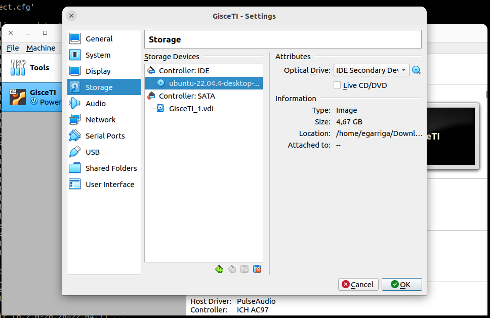

<!-- TOC INICIO -->
- [MUNTAR ERP EN VM](#muntar-erp-en-vm)
  - [VIRTUALBOX](#virtualbox)
  - [CONFIGURACIÓ](#configuració)
  - [CLIPBOARD](#clipboard)
  - [CARPETA COMPARTIDA](#carpeta-compartida)
  - [PANTALLA](#pantalla)
  - [RESOLUCION](#resolucion)
  - [HOT KEYS](#hot-keys)
  - [ENTORNO VIRTUAL](#entorno-virtual)
  - [APPS](#apps)
    - [PYCHARM](#pycharm)
    - [BRAVE](#brave)
    - [SLACK](#slack)
    - [FLAMESHOT](#flameshot)
  - [DESABIL·LITAR SSH SERVER](#desabillitar-ssh-server)
<!-- TOC FIN -->

# MUNTAR ERP EN VM

## VIRTUALBOX

Aquesta part nose sabem que far, però si que ajuda a copia i enganxa a trebes de VM i PC

```bash
sudo apt update
sudo apt install virtualbox virtualbox-ext-pack virtualbox-guest-additions-iso
```

Restart VM

## CONFIGURACIÓ

Afegir imatge to install

* Almacenamiento 
  * Unidad Optica
    * IDE secundario maestro
      * Selecte Ubuntu iso



* Particion
  * Nueva tabla de particion:
    * `efi` 512 MB
      * Primari
      * Principi de disc
      * Particion sistmea "EFI"
    * `boot` 512 MB
      * Primari
      * Principi de disc
      * BIOSGURP
    * `swap` 8192 MB
      * Logic
      * area intercanvi
    * `ext4`: la resta
      * Logic
      * /
  * Install now


## CLIPBOARD

* Permanente: [DOC](https://www.youtube.com/watch?v=BGk_f6N86uI)
* Dispositivo > Portapapeles y Arrastrar > Bidireccional
* Insertar CD Guest Adicional
    * Obrir CD
    * Obrir Terminal
      * Arrestrar fitxer `autoreun.sh`
      * Executar
        * yes
* Reiniciar


<details>
<summary>[Otra opción] Pero se tiene que hacer cada vez que se inicial la máquina</summary>

```
sudo apt update
sudo apt install virtualbox-guest-x11
sudo VBoxClient --clipboard
```
</details>

## CARPETA COMPARTIDA

> [DOC](https://celerolab.com/como-montar-una-carpeta-compartida-en-virtualbox-en-ubuntu/)

* Creamos carpeta en el PC
* Config VM
  * Carpeta compartida
    * Añadir
      * Selecionar carpeta
        * Automontar
          * Hacer permanente
* En la maquina VM
  * Dar permisos
    * `sudo adduser <username> vboxsf`
    * (No estoy seguro que haga falta) `sudo systemctl restart gdm3`
  * Reinicia 


## PANTALLA

* Pantalla
  * Memoria video
    * Máx 128 MB
  * Aceleración
    * Habilitar acelaración 3D (si da problema lo sacamos)

## RESOLUCION

* Modo escalado: CTRL+C
* Preferencias
  * Monitor
    * Resolución de pantalla
      * 1920*1080(16:9)
        * Aplicar cambios

## HOT KEYS

* DTRL Dret + Key.
  * C: Modo escalado
  * F: Modo Pantalla completa
  * A: Ajustar pantalla
  * M: Minimizar
  * R: Reiniciar
  * E: Captura de pantalla
  * T: Tomar instantania
  * S: Config
  * Q: Cerrar

## ENTORNO VIRTUAL

> [MD - DOC](../programs/linux/pycharm##ENTORNO GRAFICO)

## APPS

```bash
sudo apt install git vim htop curl tmux terminator flameshot net-tools
```

### PYCHARM

> [MD - DOC](../programs/linux/pycharm##PYVHARM)


### BRAVE

> [MD - DOC](../programs/linux/pycharm##BRAVE)

### SLACK

> [MD - DOC](../programs/linux/pycharm##SLACK)

### FLAMESHOT

> [MD - DOC](../programs/linux/pycharm##FLAMESHOT)
> 
> [RFC - DOC](https://rfc.gisce.net/t/usar-xorg-en-lugar-de-wayland-en-ubuntu-22-04/1444)


## DESABIL·LITAR SSH SERVER 

> [net-tools](https://somebooks.es/comprobar-puertos-ubuntu-netstat-alternativas-parte-1/) netstat information

```bash
* Llistem
```bash
sudo netstat -tuplna | grep 0.0.0.0 | grep 22
```

* Desabilitem
```bash
sudo systemctl disable ssh.service
```

* Aturem
```bash
sudo service ssh stop
```

### UNINSTALL

* Borrar Carpeta `Virtual Box` que contiene las `OVA`
* sudo apt purge virtualbox*
  * yes
* Potser que la carpeta no estigui buida
  * sudo rm -r /usr/lib/virtualbox
* sudo apt autoremove
  * yes

  

## POSSIBLES ERRORS

### TECLADO

* Settings > Teclado > Añadir Español > Eliminar otros