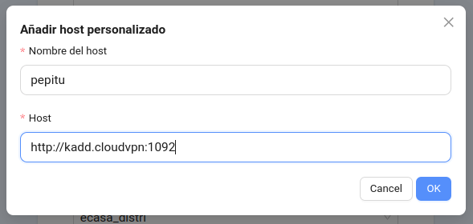

<!-- TOC INICIO -->
- [PUDB](#pudb)
  - [SERVER DEBUG](#server-debug)
    - [OBRIR UNA NOVA CONNECCIÓ PER WEBCLIENT O GTK](#obrir-una-nova-connecció-per-webclient-o-gtk)
      - [Obrim un nou ERP a través d'un port en paral·lel](#obrim-un-nou-erp-a-través-dun-port-en-parallel)
      - [Pel webclient serà per MSGPACK. [DOC](https://rfc.gisce.net/t/como-arrancar-un-proceso-msgpack-webclient-en-otro-puerto/1526)](#pel-webclient-serà-per-msgpack-dochttpsrfcgiscenettcomo-arrancar-un-proceso-msgpack-webclient-en-otro-puerto1526)
  - [Documentation](#documentation)
  - [commands](#commands)
  - [IMPORT PDB](#import-pdb)
    - [Running the File Directly with PuDB](#running-the-file-directly-with-pudb)
    - [Inserting import pudb; pudb.set_trace() in Your Code:](#inserting-import-pudb-pudbset_trace-in-your-code)
<!-- TOC FIN -->

# PUDB

(doc)[https://documen.tician.de/pudb/]

A d'esta instal·lat en un entorn de python. És un paquet.

## SERVER DEBUG

Entra com usuari erp

```
sudo su - erp
```

* Anar el path
`cd src/erp`

* importar pudb. des del fitxer i linea on volem començar a debugar
```
# addons/gisce/GISCEMaster/
vim <path_file>

import pudb; pu.db
```

### OBRIR UNA NOVA CONNECCIÓ PER WEBCLIENT O GTK

:warning: Es possible que es quedi penjat el proces. Per tancar-lo:

```shell
ps aux | grep msgpack_daemon
kill -9 <proces>
```

#### Obrim un nou ERP a través d'un port en paral·lel

```bash
EMILI=1 DEBUG_ENABLED=1 OORQ_ASYNC=False 
python /home/erp/src/erp/server/bin/openerp-server.py --no-netrpc --price_accuracy=6 --config=/home/erp/conf/**.conf 
--port 1982 --interface=0.0.0.0
```

* Atributs
  * `DEBUG_ENABLED`: habilita el mode debug
  * `OORQ_ASYNC`:
  * `EMILI`: Perquè dues persones poguin treballa en debug amb el mateix codi, però no es vegin els DEBUGs de cada un. Així que només afectin els que un afegeix
  * `interface` o `OPENERP_MSGPACK_HOST`: [0.0.0.0] mascara
  * `port` o `OPENERP_MSGPACK_PORT`: [3333] un port que no existeixi


#### Pel webclient serà per MSGPACK. [DOC](https://rfc.gisce.net/t/como-arrancar-un-proceso-msgpack-webclient-en-otro-puerto/1526)

```bash
DEBUG_ENABLED=True OPENERP_MSGPACK_HOST=0.0.0.0 OPENERP_MSGPACK_PORT=**** 
python /home/erp/src/erp/server/bin/msgpack_daemon.py --no-netrpc --price_accuracy=6 --config=/home/erp/conf/**.conf
```

* Atributs
  * `OPENERP_MSGPACK_HOST`:
  * `OPENERP_MSGPACK_PORT`: 

* Validar que el process esta corrent correctament 
`Server started in ...`

* Matar el process
`CTRL+C`

* Obrir el Webclient en local:
  * El nóm identificatiu [el que vulguem] 
  * http://***:port [SEMPRE HTTP] (**** = ae-pre-distri.cloudvpn)
  * Dades d'ingrés les mateixes




## Documentation

[documen.tician](https://documen.tician.de/pudb/)
[kimsereylam.com](https://www.kimsereylam.com/python/2020/01/17/debug-python-with-pudb.html)

## commands

* `c`: Continua l'execució del programa.
* `s`: Entra a la funció.
* `r`: Aneu a la línia de retorn de la funció actual.
* `n`: Aneu a la línia següent.
* `u`: Puja un nivell de la pila.
* `d`: Baixa un nivell de la pila.
* `b`: Estableix un punt d'interrupció o elimina un punt d'interrupció.
* `q`: [exit] Finalitza el debug sense tancar l'execució de l'ERP
* `CTRL+V`: Centra't a la pestanya de variables.
* `CTRL+C`: Centra't a la pestanya de codi.
* `CTRL+X`: Centra't a la pestanya de l'intèrpret d'ordres o torna al codi quan estàs a la pestanya de l'intèrpret d'ordres.
* `SHIFT+?`: help


## IMPORT PDB


### Running the File Directly with PuDB

This will run linea by linea from start to end file

```bash
python -m pudb.run your_script.py
```

### Inserting import pudb; pudb.set_trace() in Your Code:

This will find the `set_trace()` and be executed from this point

```bash
# Execute
python3 <file.py>
```

```python
import pdb

pdb.set_trace()
```

* Step-by-Step debugging to go into more internal
  * `n`: Execute the next statement… (next)
  * `ENTER`: Repeating the last debugging command… 
  * `q`: Quitting it all… (quit)
  * `p`: Printing the value of variables… (print)
  * `c`: Turning off the (Pdb) prompt… (continue)
  * `l`: Seeing where you are… (list)
  * `s`: Stepping into subroutines… (step into)
  * `r`: Continuing… but just to the end of the current subroutine… (return)

* Assign a new value
  * a) !b = "B"

* Set a breakpoint
  * a) break linenumber
  * b) break functionname
  * c) break filename:linenumber

* Temporary breakpoint
  * a) tbreak linenumber

* Conditional breakpoint
  * a) break linenumber, condition