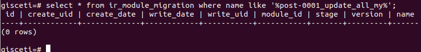

<!-- TOC INICIO -->
- [DEPLOY](#deploy)
  - [PASSOS](#passos)
  - [TIRAR ENDARRERA UN COMMIT + PUJADA A SERVIDOR](#tirar-endarrera-un-commit--pujada-a-servidor)
<!-- TOC FIN -->

# DEPLOY

## PASSOS

* comitajem [git](https://rfc.gisce.net/t/memento-git-deploy/1795)
* executar [SASTRE](https://rfc.gisce.net/t/memento-sastre/1792)
* passar [scripts de migració](https://rfc.gisce.net/t/memento-scrips-de-migracio/1793)
* restart [server](https://rfc.gisce.net/t/memento-restar-server/1878)


## TIRAR ENDARRERA UN COMMIT + PUJADA A SERVIDOR

> Des de servidor

* Reset git des de un commit anteroior.

`git reset --hard <commit>`

* Borrar patches (si n'hi han).

``` 
cd patches
rm -rf <folder_PR>
``` 

* Borra de la bases de dades les migracions

`psql <nom_BD>`

> * `PODEM` fer cerca del psql o diferentes comandes antigues amb:
>
> `CLTR + r` .

  

* Borrem la migració que ens interessa.

`select * from ir_module_migration where name like '%file%';`

* Executem **_PROCEDURE_**

``` 
begin; 
delete from ir_module_migration where id = <id>;
commit; **si es correcte**
```