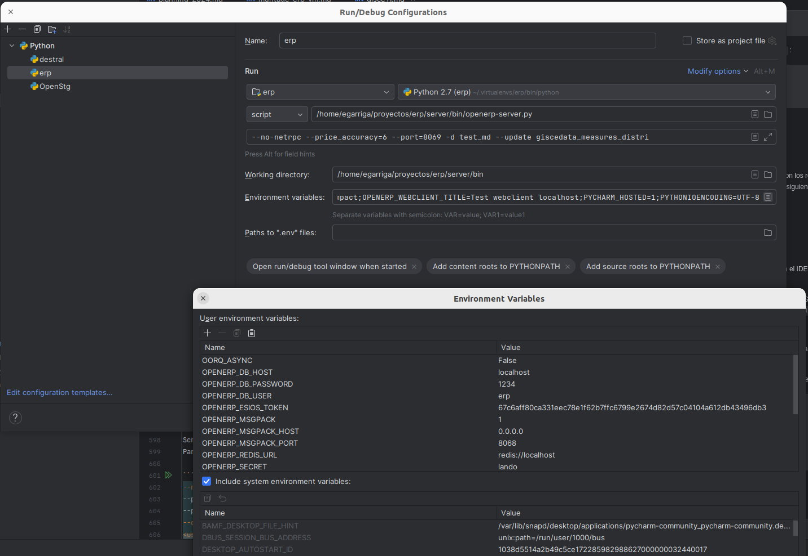
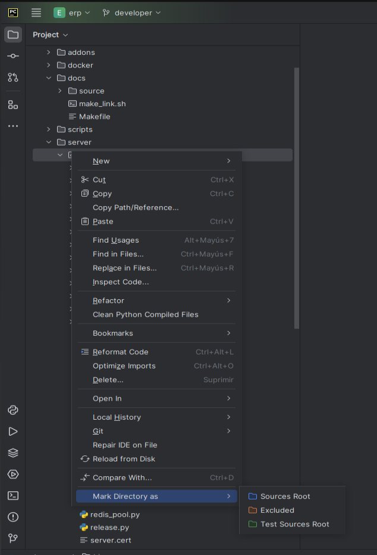

<!-- TOC INICIO -->
- [9. Inicio de un servidor en entorno local](#9-inicio-de-un-servidor-en-entorno-local)
  - [Configuración del IDE - OpenERP-Server](#configuración-del-ide---openerp-server)
  - [DESTRAL](#destral)
- [Configurar la ejecución de Destral](#configurar-la-ejecución-de-destral)
      - [Instalación de requerimientos](#instalación-de-requerimientos)
      - [Primer arranque](#primer-arranque)
  - [Módulos](#módulos)
  - [ERP](#erp)
    - [Configuración de Ficheros](#configuración-de-ficheros)
  - [Integrar en ERP-Server](#integrar-en-erp-server)
<!-- TOC FIN -->

# 9. Inicio de un servidor en entorno local

Des de l'entorn ERP `workon erp`

Antes de ejecutar el servidor es necesario configurar la carpeta `server/bin/addons` con los repositorios de fuera del ERP. 
Siempre que se añada otro módulo con un repositorio externo será necesario ejecutar el siguiente script:

```bash
python tools/link_addons.py
```

<details>
<summary>:warning: Si no funciona</summary>

* Salimos 
* Entramos
* Executamos pip freeze
* python tools/link_addons.py

</details>


## Configuración del IDE - OpenERP-Server

Primero abrimos el proyecto ERP que hemos clonado.

El primer paso es configurar el virtualenv creado anteriormente para OpenERP-Server en el IDE. La explicación siguiente solo sirve para PyCharm.

* Abrimos el menú “File > Settings”.
* Accedemos a la pestaña “Project:ERP > Project Interpreter”
* Seleccionamos el virtualenv del erp en el desplegable. 
  * Si no se encuentra ahí 
    * `/home/<usuario>/.virtualenvs/erp`
  * Si no se encuentra ahí
    * Add Interprete > Local > Existing > python

* Para pyenv
  * Settings
  * Python Interpreter
    * Dropdown menu 
      * show all 
        * click on `+` 
          * search (Base interpreter ...) 
            * /Users/emiligarriga/.pyenv/versions


## DESTRAL

Destral se utiliza para realizar los tests del ERP.

Destral también nos sirve para generar Bases de Datos con datos de DEMO.

# Configurar la ejecución de Destral

Configuración para poder realizar los tests del ERP (los mismos que realiza `drone.gisce.net`) en local.

* Clonar
```bash
git clone git@github.com:gisce/destral.git ~/proyectos/destral
cd ~/proyectos/destral
```

* Desde el entorno virtual "erp"
```bash
pip install -e .
```

> :information_source: És possible que peti alhora d'instal·lar les dependencies degut a que no tenim algunes llibreries de desenvolupament bàsiques. Per python 3 necessitem: **python3-dev** (`sudo apt install python3-dev`) i **wheel** (`pip install wheel`)

Seguidamente podemos añadir el proyecto a nuestro IDE (i.e. PyCharm).

* Fichero de configuración de ERP a utilizar
```bash
#OPENERP_CONFIG=/home/<usuario>/proyectos/erp/conf/fichero.conf
```

* Si no se corre PostgreSQL en el puerto por defecto, utilizar el siguiente parámetro
```bash
#OPENERP_DB_PORT=5432
```

* Si no se desea generar una nueva BdD, utilizar el siguiente parámetro
```bash
#OPENERP_DB_NAME=test_XXX
```

> :NOTA: 
> Hay que recordar que algunos módulos del ERP trabajan con la extensión TimeScaleDB de Postgres. 
> Para evitar errores, es mejor asegurarse de que se tiene instalada y configurada la extensión.


> [MD - Destral](../../erp/ERP_destral_config.md) 
> 
> [RFC - Destral](https://rfc.gisce.net/t/configurar-entorno-de-test-destral/304)


* Proyecto: `destral` (si se tiene más de un proyecto abierto)

* Python Interpreter: Escoger el virtualenv del ERP

* Script
```text
/home/<usuario>/proyectos/destral/destral/cli.py
```

```txt
-m <model> --no-drop --no-requirements -t <testClass>.<especific_test>
```

* `--m`: nodel de dades
* `-–no-drop`: no borrar la base de dades
* `--no-requirements`: no borrar els requeriments
* `-t`: Nombre de la clase de `TEST`
  * Test especifico

* Working Directory: 
```text
/home/<usuario>/proyectos/erp
```


```text
DESTRAL_TESTING_LANGS=[]; 
OORQ_ASYNC=False;
OPENERP_SRID=25831;
OPENERP_ADDONS_PATH=/home/egarriga/proyectos/erp/server/bin/addons;
OPENERP_DB_HOST=localhost;
OPENERP_DB_NAME=test_tmd;
OPENERP_DB_PASSWORD=1234;
OPENERP_DB_PORT=5432;
OPENERP_DB_USER=erp;
OPENERP_ESIOS_TOKEN=67c6aff80ca331eec78e1f62b7ffc6799e2674d82d57c04104a612db43496db3;
OPENERP_PRICE_ACCURACY=6;
OPENERP_REDIS_URL=redis://localhost;
OPENERP_ROOT_PATH=/home/egarriga/proyectos/erp/server/bin;
OPENERP_SECRET=lando_calrissian;
PYTHONIOENCODING=UTF-8;
PYTHONPATH=/home/egarriga/proyectos/erp/server/bin:/home/egarriga/proyectos/erp/server/bin/addons:/home/egarriga/proyectos/erp/server/sitecustomize:$PYTHONPATH;
PYTHONUNBUFFERED=1;
```

#### Instalación de requerimientos

Antes del primer arranque, es necesario instalar los requerimientos del proyecto:

* Desde el entorno virtual "erp"
```bash
pip install -r requirements.txt -r requirements-dev.txt
pip install -r ../oorq/requirements.txt
```

#### Primer arranque

La primera vez que iniciemos el servidor será necesario que ejecutemos una actualización de todos los 
modulos para que se instalen todos los requisitos. Para hacerlo debemos añadir el parámetro `--update=all`.


## Módulos

* Si al ejecutar Destral aparece algún error indicando que no se encuentra algún módulo en concreto, 
hay que instalarlo manualmente en el entorno virtual clonándolo del repositorio correspondiente
```bash
cd ~/proyectos
git clone url_modulo
cd nombre_modulo
pip install -e .
```

## ERP

> [MD - ERP](../../erp/ERP_config.md) 


* Proyecto: `erp` (si se tiene más de un proyecto abierto)

* Python Interpreter: Escoger el virtualenv del ERP

* Script
```text
/home/<usuario>/proyectos/erp/server/bin/openerp-server.py
```
```
--no-netrpc --price_accuracy=6 --port=8069 --db_user erp --database test_db -–update=view,view --run-scripts=<view> --stop-after-init
```

* `--DB_USER`: usuari de la base de dades.
* `-d` base de dades a la que apunta.
* `-–update`: *[OPCIONAL]* Si es necessita refrescar una vista o varies vistes. (sense espais i separat per comes).
  * La primera vez tiene que ser `--update=all`
* `--stop-after-init`: *[OPCIONAL]* Perque s'aturi després d'executar-se.
* `----run-scripts`: *[OPCIONAL]* Per corre els scripts de migració. Molt útil per testeja aquests en local.

* Working directory: 
```text
/home/<usuario>/proyectos/erp/server/bin
```

```text
OORQ_ASYNC=False;
OPENERP_SRID=25831;
OPENERP_DB_HOST=localhost;
OPENERP_DB_PASSWORD=1234;
OPENERP_DB_USER=erp;
OPENERP_ESIOS_TOKEN=67c6aff80ca331eec78e1f62b7ffc6799e2674d82d57c04104a612db43496db3;
OPENERP_MSGPACK=1;
OPENERP_MSGPACK_HOST=0.0.0.0;
OPENERP_MSGPACK_PORT=8068;
OPENERP_REDIS_URL=redis://localhost;
OPENERP_SECRET=lando;
OPENERP_WEBCLIENT_PREVIEW_FEATURES=True;
OPENERP_WEBCLIENT_PRIMARY_COLOR=#007bff;
OPENERP_WEBCLIENT_REFRESH_TOKEN_SECONDS_THRESHOLD=300;
OPENERP_WEBCLIENT_THEME_MODE=compact;
OPENERP_WEBCLIENT_TITLE=Test webclient localhost;
PYCHARM_HOSTED=1;
PYTHONIOENCODING=UTF-8;
PYTHONUNBUFFERED=1
```

Debemos marcar las casillas:
Necesarias:
Añadir “content roots” al “PYTHONPATH”
Añadir “source roots” al “PYTHONPATH”

Recomendadas:
Show this page - Muestra la ventana de configuración al ejecutar
Single instance only - Asegura que se ejecute una sola instancia del ERP



### Configuración de Ficheros

Hace falta marcar como “Sources root”, en este orden, las siguientes carpetas:

```
server/bin/addons
server/bin
server/sitecustomize
```



## Integrar en ERP-Server
Por comodidad, es posible tener el proyecto "destral" adjunto al proyecto "erp" en PyCharm.
De este modo, se puede hacer la implementacioń y el debug en una misma ventana, algo especialmente útil cuando se programan los tests de una implementación.

Para ello, simplemente hay que abrir en PyCharm el proyecto "erp" y a continuación abrir el proyecto "destral". Cuando el asistente nos pregunte cómo queremos abrirlo, hay que seleccionar "Attach" para que se adjunte al proyecto "erp".

Por último, hay que crear una configuración para ejecutar "destral" del mismo modo que cuando se ejecuta como proyecto individual, manteniendo las mismas variables del entorno, los mismos parámetros y el mismo directorio de trabajo

