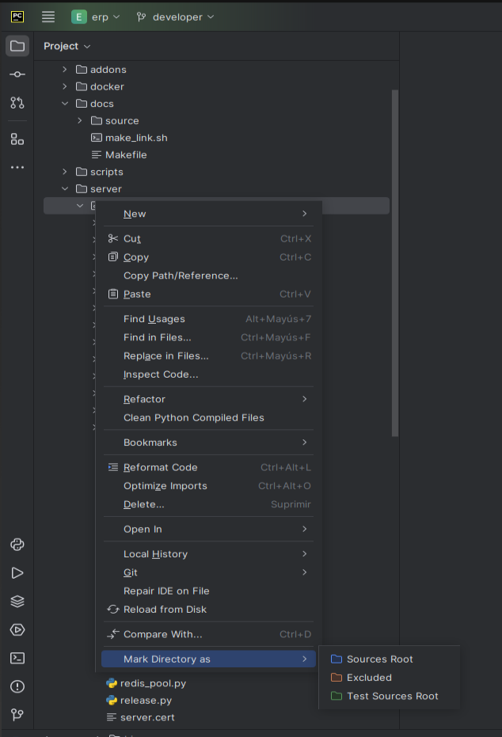

<!-- TOC INICIO -->
- [01. Instalar S.O.](#01-instalar-so)
  - [Paquetes del Sistema](#paquetes-del-sistema)
  - [Instal·lació OpenVPN network manager](#installació-openvpn-network-manager)
- [02. Instalamos Python 2.7](#02-instalamos-python-27)
- [03. Entorno de desarrollo](#03-entorno-de-desarrollo)
  - [Definir editor de texto por defecto](#definir-editor-de-texto-por-defecto)
  - [Estructura de ficheros](#estructura-de-ficheros)
  - [Entorno virtual de Python](#entorno-virtual-de-python)
  - [Configuración GIT](#configuración-git)
    - [Clave GPG](#clave-gpg)
- [04. OpenERP](#04-openerp)
  - [OpenERP-Server](#openerp-server)
    - [Repositorios requeridos](#repositorios-requeridos)
  - [OpenERP-Client](#openerp-client)
- [05. Instalación del cliente web](#05-instalación-del-cliente-web)
- [06. Install GTK](#06-install-gtk)
- [07. Programas para desarrollar](#07-programas-para-desarrollar)
  - [PYCHARM](#pycharm)
- [08. Inicialización del entorno](#08-inicialización-del-entorno)
  - [DOCKERS](#dockers)
    - [PostgresSQLOpenERP-Server](#postgressqlopenerp-server)
    - [MongoDB + Redis en Docker](#mongodb--redis-en-docker)
    - [VALIDACIONES](#validaciones)
- [9. Inicio de un servidor en entorno local](#9-inicio-de-un-servidor-en-entorno-local)
  - [Configuración del IDE - OpenERP-Server](#configuración-del-ide---openerp-server)
  - [DESTRAL](#destral)
- [Configurar la ejecución de Destral](#configurar-la-ejecución-de-destral)
      - [Instalación de requerimientos](#instalación-de-requerimientos)
      - [Primer arranque](#primer-arranque)
  - [Módulos](#módulos)
  - [ERP](#erp)
    - [Configuración de Ficheros](#configuración-de-ficheros)
  - [Integrar en ERP-Server](#integrar-en-erp-server)
- [10. Otras configuraciones:](#10-otras-configuraciones)
- [Bonus track: Utilidades varias](#bonus-track-utilidades-varias)
- [Material visual per a introduïr-se al sector elèctric:](#material-visual-per-a-introduïr-se-al-sector-elèctric)
<!-- TOC FIN -->

# 01. Instalar S.O.

Recomendamos el uso de Ubuntu, ya que es el que utilizamos nosotros. Esta guía debería servir para todas las distribuciones Debian.

Una vez instalado, actualizaríamos el listado de paquetes y actualizaríamos:

```bash
sudo apt update
sudo apt upgrade
```

## Paquetes del Sistema

Se requieren los siguientes paquetes, para empezar:

- openvpn, para conexiones en la red de la empresa
  - Paquetes: `openvpn, network-manager-openvpn` i possiblemente `network-manager-openvpn-gnome`
- python, necessario para desarrollar en Python
  - Paquetes: `python, python-dev, python-pip`
- tmux, multiplexor de terminal
  - Paquete: `tmux`, `terminator`
- git, necesario para el control de versiones y el desarrollo contínuo
  - Paquete: `git`

Ejecutaríamos:
```bash
sudo apt install git vim htop curl openssh-server
```

## Instal·lació OpenVPN network manager

> [MD](../VPN.md)
> 
> [RFC](https://rfc.gisce.net/t/manual-configuracio-de-vpn-amb-el-network-manager/898)


```bash
sudo apt-get install openvpn network-manager-openvpn network-manager-openvpn-gnome
```

Això ens permet poder afegir VPNs compatibles amb OpenVPN.

**Configuració VPN a Ubuntu**

* Obrim Settings > Network (Red)
  * Fem click a afegir una VPN 
    * Triem la opció de importar-la des d'un arxiu.

* Seleccionem el `.ovpn` que ens interessi 
  * Hi escribim la contrasenya a la pestanya `Identity` amb la opció `Certificates (TLS)`.

* Dins la pestanya IPv4 seleccionem la opció:
  * `Use this connection only for resources on this network` per tal de poder tenir més de una VPN activa a la vegada.

* A l'hora de connectar-la només cal clicar-hi a sobre o utilitzar:
```bash
nmcli con up id NomDeLaConnexio
```

# 02. Instalamos Python 2.7

El ERP se ejecuta sobre Python 2.7, aunque se espera que en un futuro no muy lejano se ejecute sobre Python 3. 
Eso obliga a que el Sistema Operativo cuente con una versión 2.7 de Python, aunque sea para poder crear entornos virtuales para desarrollar.


* Instalamos repositorios necesarios para Pyenv
```bash
sudo apt install -y make build-essential libssl-dev \
zlib1g-dev libbz2-dev libreadline-dev libsqlite3-dev \
wget curl llvm libncursesw5-dev xz-utils tk-dev \
libxml2-dev libxmlsec1-dev libffi-dev liblzma-dev libpq-dev
```

* Descargamos Pyenv y lo ejecutamos
```bash
curl https://pyenv.run | bash
```

* Exportamos Pyenv al PATH del sistema
```bash
echo -e 'export PYENV_ROOT="$HOME/.pyenv"\nexport PATH="$PYENV_ROOT/bin:$PATH"' >> ~/.bashrc
echo -e 'eval "$(pyenv init --path)"\neval "$(pyenv init -)"' >> ~/.bashrc
```

* Refrescamos la ventana del terminal
```bash
exec "$SHELL"
```

* Install python2
```bash
sudo apt install python2
```

* Comprobamos la versión de Pyenv
```bash
pyenv --version
```

* (Opcional) Es posible actualizar Pyenv con el siguiente comando
```bash
pyenv update
```

* Instalamos la versión de Python 2.7
```bash
pyenv install 2.7.18
```

* Establecemos la versión de Python 2.7 como el Python por defecto
```bash
pyenv global 2.7.18
```

* El siguiente comando devería mostrar que el sistema usa la  versión deseada
```bash
python --version
```

* Descargamos e instalamos pip
```bash
curl https://bootstrap.pypa.io/pip/2.7/get-pip.py --output get-pip.py
python get-pip.py
```

* [Opcionales] (utilizados por GISCE-TI)
```bash
sudo apt install tmux openvpn network-manager-openvpn meld terminator
```

<details>
<summary>Para distribuciones de Ubuntu desde 20.04 hasta 21.10 "python-pip" debe instalarse de forma alternativa, pues no viene incluido en los paquetes.</summary>

https://linuxize.com/post/how-to-install-pip-on-ubuntu-20.04/#installing-pip-for-python-2

```bash
sudo add-apt-repository universe
sudo apt update 
sudo apt install python2
sudo apt install python python-dev
```

</details>

<details>
<summary>Para Ubuntu 22.04 en adelante, python 2.7 tiene por nombre python</summary>

```bash
sudo apt install python2 python2-dev
```

* Instalamos el pip

```bash
curl https://bootstrap.pypa.io/pip/2.7/get-pip.py --output get-pip.py
sudo python2 get-pip.py
```

</details>

# 03. Entorno de desarrollo

En esta sección se van a configurar varios parámetros del propio entorno, como el editor de texto por defecto o la herramienta para crear entornos virtuales de Python para desarrollar.

## Definir editor de texto por defecto

Desde GISCE-TI utilizamos VIM, sin embargo se puede utilizar cualquier otro. Para configurarlo por defecto, utilizamos:

`sudo update-alternatives --config editor`

## Estructura de ficheros

Definiremos una carpeta para los proyectos i.e. `~/proyectos` con el comando:
```bash
mkdir ~/proyectos
```

## Entorno virtual de Python

Instalaremos los siguientes paquetes de python para desarrollar con entornos virtuales y desde consola:

<details>
<summary>Para versiones de Ubuntu superiores a la 24.04</summary>

* pyenv y otras herramientas de entornos virtuales, pueden dar problemas
```bash
sudo -H ~/.pyenv/shims/pip install --upgrade pip
sudo -H ~/.pyenv/shims/pip install ipython
sudo -H ~/.pyenv/shims/pip install virtualenvwrapper  
```

* Definimos el directorio donde se crearán los entornos virtuales de Python
```bash
echo export WORKON_HOME=$HOME/.virtualenvs >> ~/.bashrc
```

* La siguiente línea sólo para Ubuntu 22.04 o posterior
```bash
echo export VIRTUALENVWRAPPER_PYTHON=~/.pyenv/shims/python  >> ~/.bashrc
```

* Añadimos el virtualenwrapper al arranque del terminal de Ubuntu
```bash
echo source ~/.pyenv/versions/2.7.18/bin/virtualenvwrapper.sh >> ~/.bashrc
```

</details>

<details>
<summary>Para versiones de Ubuntu anteriores a la 24.04</summary>

```bash
sudo -H pip install --upgrade pip
sudo -H pip install ipython
sudo -H pip install virtualenvwrapper  
# pyenv y otras herramientas de entornos virtuales, pueden dar problemas

# Definimos el directorio donde se crearán los entornos virtuales de Python
echo export WORKON_HOME=$HOME/.virtualenvs >> ~/.bashrc
# La siguiente línea sólo para Ubuntu 22.04 o posterior
echo export VIRTUALENVWRAPPER_PYTHON=/usr/bin/python2  >> ~/.bashrc
# Añadimos el virtualenwrapper al arranque del terminal de Ubuntu
echo source /usr/local/bin/virtualenvwrapper.sh >> ~/.bashrc
```

</details>

```bash
source ~/.bashrc
```

Utilizando los comandos que usaremos más adelante para crear nuestros entornos de 
**OpenERP-Client** y **OpenERP-Server**

<details>
<summary>Es posible crear un entorno virtual</summary>

* Para crear el venv
```bash
mkvirtualenv <nombre> -a <dirección del proyecto>
``` 

* Para eliminar el venv
```bash
rmvirtualenv <nombre> 
``` 

* Para activar/desactivar el venv
```bash
workon
``` 
```bash
deactivate
``` 

* Para crear un venv temporal
```bash
mktmpenv
``` 

* Se elimina al hacer 
```bash
deactivate
``` 

</details>

## Configuración GIT

Presuponemos que se dispone de usuario GIT con permisos para el código de GISCE-TI.

El primer paso será generar las claves SSH con el comando:
```bash
ssh-keygen -t rsa -b 4096
```

Seguidamente añadimos esta clave a nuestro usuario de GitHub (User > Setting > SSH and GPG keys)
```bash
cat ~/.ssh/id_rsa.pub
```

Por último hace falta configurar un nombre y un correo para que git nos pueda identificar. Lo haremos con el siguiente comando:
```bash
git config --global -e
```

El nombre no es vinculante, pero el correo debe coincidir con el correo del usuario de GitHub.
Se puede configurar el editor de GIT por defecto en esta configuración.

Un ejemplo de configuración sería:
```commit
[user]
        email = <user>@<domain>
        name = Demo Name
[core]
        editor = vim
[commit]
        gpgsign = true
```

### Clave GPG

Sería interessante que todos los participantes utilizaramos claves GPG en nuestro ordenador principal. 
Se puede seguir la [Guía de GitHub para configurar una clave GPG](https://help.github.com/articles/signing-commits-using-gpg/).

<details>
<summary>Clave GPG</summary>

* To configure your Git client to sign commits by default for a local repository, in Git versions 2.0.0 and above
```commit
# Aquesta part s'ha introduit amb el fitxer de configuració
# [commit]
#        gpgsign = true

git config commit.gpgsign true 
```

* To sign all commits by default in any local repository on your computer.
```bash
git config --global commit.gpgsign true
```

</details>

# 04. OpenERP

## OpenERP-Server

El primer repositorio que clonaremos y configuraremos será “OpenERP Server”, disponible en: https://github.com/gisce/erp

```bash
cd ~/proyectos
git clone git@github.com:gisce/erp.git
```

Para el entorno hará falta instalar los siguientes paquetes de sistema:

```bash
sudo apt install libxslt1-dev libjpeg-dev gcc g++
```

Crearemos el entorno virtual de python con:

> **NOTE**
> 
> Con -a ponemos el directorio del proyecto, lo que nos moverá al momento a la carpeta de este.

<details>
<summary>Versiones de Ubuntu superiors a la 24.04</summary>

```bash
mkvirtualenv erp -a ~/proyectos/erp -p python
```

</details>

<details>
<summary>Versiones de Ubuntu anteriores a la 24.04</summary>

```bash
mkvirtualenv erp -a ~/proyectos/erp -p python2
```

</details>

```bash
workon erp
```

* Ya desde el entorno virtual, instalamos los requerimientos básicos con:

```bash
easy_install egenix-mx-base
```

```bash
for a in vatnumber mako reportlab pydot tqdm psycopg2 Babel \
pymongo==2.9 rq==0.12 raven sentry psutil times xlwt pysftp \
redis osconf slugify fuzzywuzzy lockfile marshmallow==2.0.0b2 \
Python-Chart reportlab==3.0 osconf "libcomxml<2.2.4" \
unidecode pprintpp autoworker cython
do 
    pip install $a
done
```

:RE-IMPORTAR REPOS:

### Repositorios requeridos

Instalaremos los requerimientos necessarios mediante el siguiente comando:

* Recuerda de ir al directorio de proyectos si no estás en el!
```bash
cd ~/proyectos
```

* Instalamos
```bash
cat > repositories <<EOF
mongodb_backend gisce
oorq api_v5
openerp-sentry v5_legacy
poweremail v5_backport
poweremail-modules master
spawn_oop master
ws_transactions master
sepa master
libFacturacioATR master
switching master
libComXML master
cchloader master #Temporaly gisce branch
sippers master
ir_attachment_mongodb master
qreu master
enerdata master
ooop xmlrpc_transaction # webforms and remote scripts need gisce's xt version
arquia master # webforms
sii master
empowering master #Temporaly FIX_marshmallow_requirement_minimum_version
gestionatr master
distri-remesa-parser master
pandapower_erp master
pandapower_validator master
crm_poweremail
EOF

cat repositories | while read p b comment; do
	git clone git+ssh://git@github.com/gisce/$p.git
	(cd $p; git checkout $b )
done

ln -s poweremail poweremail2
ln -s libFacturacioATR libfacturacioatr

for a in sepa libFacturacioATR gestionatr \
switching libComXML sippers qreu enerdata arquia ooop \
distri-remesa-parser
do
    (cd $a; pip install -e .)
done
```

## OpenERP-Client

...


# 05. Instalación del cliente web

> [WEBCLIENT](https://rfc.gisce.net/t/deploy-webclient-local-development/1248) (Configurar el servidor ERP)

*  Cal tener instalado el protocolo `MSGPACK`

> Nota: Cal assegurar-se d’instal·lar tot el següent l’Entorn Virtual relatiu al ERP

<details>
<summary>MSGPACK</summary>

Para activar en el servidor ERP la utilización del protocolo MsgPack 7 se puede hacer de la siguiente forma

Se deben tener instalados los siguiente paquetes:

* Sistema
```bash
sudo apt install libev-dev
```

* Python
```bash
pip install bjoern msgpack flask "flask-cors < 4.0"
```

* variables de entorno
```bash
OPENERP_MSGPACK=1
OPENERP_MSGPACK_HOST=0.0.0.0
OPENERP_MSGPACK_PORT=8068
```

</details>

Hem de tenir la variable d’entorn OPENERP_SECRET amb un string qualsevol

* Abrimos el fichero bashrc
```bash
vim ~/.bashrc
```

* Definimos la varible
```bash
OPENERP_SECRET="whatever"
```

* Reiniciamos el bash
```bash
source ~/.bashrc
```

* Comprobamos que se a creado correctamente
```bash
echo $OPENERP_SECRET
```

* Instalamos paquestes de python en la carpeta del repositorio `erp`
```bash
# cd ~/home/<usuario>/proyectos/erp
pip install -r server/bin/msgpackapi/requirements.txt
```

* Tenir instal·lat nodejs (ho podem fer amb nvm) amb l’usuari erp
```bash
curl -o- https://raw.githubusercontent.com/nvm-sh/nvm/v0.39.7/install.sh | bash
```

* Recarrergar la shell
```bash
exec $SHELL
```

* Instal·lar la versió de nodejs
```bash
nvm install v20.5.0
```

* Clonar el repositori
```bash
# cd /home/<usuario>/proyectos 
git clone git@github.com:gisce/webclient.git -b v2
cd webclient
```

* Si tenim el repositori clonat de fa temps, recordar de canviar-nos a la branca v2
```bash
git checkout v2
```

* Instal·lar dependències
```bash
npm ci
```

* Crear el fitxer de configuració .env fent els canvis que considerem
```bash
cp .env.sample .env
```

* Arrancar el client
```bash
npm start
```

Si al anar a iniciar sessió al client web, no us apareix el vostre host, l’heu de crear manualment amb el botó “Añadir host personalizado”. 
Poseu el nom que volgueu i com a “host” el servidor d’ERP que esteu corrent. http://localhost:8068/


# 06. Install GTK

Si se quiere instalar el cliente de escritorio GTK

El siguiente repositorio será el cliente del OpenERP, disponible en: https://github.com/gisce/erpclient

* Por si acaso no nos viene instalado el paquete pip
```bash
mkdir ~/proyectos
cd ~/proyectos
```

* Clonamos
```bash
git clone git@github.com:gisce/erpclient.git
cd erpclient
```

* Proseguimos con la instalación

<details>
<summary>Si se usa Ubuntu 22.04</summary>

* Antes de instalar estos dos repositorios, hay que instalar sus dependencias:
```bash
wget http://es.archive.ubuntu.com/ubuntu/pool/universe/w/what-is-python/python-is-python2_2.7.17-4_all.deb
wget http://es.archive.ubuntu.com/ubuntu/pool/main/p/pycairo/python-cairo_1.16.2-1_amd64.deb
wget http://es.archive.ubuntu.com/ubuntu/pool/universe/p/pygobject-2/python-gobject-2_2.28.6-12ubuntu3_amd64.deb
wget http://es.archive.ubuntu.com/ubuntu/pool/main/libf/libffi/libffi6_3.2.1-8_amd64.deb
wget http://es.archive.ubuntu.com/ubuntu/pool/universe/libg/libglade2/libglade2-0_2.6.4-2.4_amd64.deb
sudo dpkg -i python-is-python2_2.7.17-4_all.deb
sudo dpkg -i libffi6_3.2.1-8_amd64.deb
sudo dpkg -i libglade2-0_2.6.4-2.4_amd64.deb
sudo dpkg -i python-gobject-2_2.28.6-12ubuntu3_amd64.deb
sudo dpkg -i python-cairo_1.16.2-1_amd64.deb
```

* Creamos el entorno virtual de Python para el cliente de ERP
```bash
mkvirtualenv erpclient --system-site-packages -a ~/proyectos/erpclient
```

* Nos movemos a la carpeta del repositori
```bash
cd ~/proyectos/erpclient
```

* Entramos en el entorno virtual
```bash
workon erpclient
```

* Instalamos paquetes de python
```bash
easy_install egenix-mx-base
pip install -r requirements.txt
pip install pyOpenSSL
```

:warning: Los paquetes `python-gtk2` y/o `python-glade2` dan problemas para instalarse, se deben descargar e instalar manualmente desde su paquete `.deb`.

</details>

<details>
<summary>Si se usa Ubuntu 24.04</summary>

```bash
wget http://es.archive.ubuntu.com/ubuntu/pool/universe/p/pygtk/python-gtk2_2.24.0-5.1ubuntu2_amd64.deb
wget http://es.archive.ubuntu.com/ubuntu/pool/universe/p/pygtk/python-glade2_2.24.0-5.1ubuntu2_amd64.deb
sudo dpkg -i python-gtk2_2.24.0-5.1ubuntu2_amd64.deb
sudo dpkg -i python-glade2_2.24.0-5.1ubuntu2_amd64.deb

# En caso de dar error instalar lo siguiente:
sudo apt install python-cairo
sudo apt --fix-broken install
```

</details>

* El cliente utiliza el paquete `pygtk`, que no se lleva bien con los entornos virtuales, por lo que hará falta descargar y ejecutar este script en el entorno virtual.
https://gist.github.com/ecarreras/331db9be3b32b2e2ea5a1d4efc0ca69f


* Se puede pegar directamente el código en el terminal o se puede descargar el fichero [tools/link_pygtk_venv.sh](../../tools/link_pygtk_venv.sh) y ejecutarlo dándole permisos antes

```bash
chmod 711 ./link_pygtk_venv.sh
```

<details>
<summary>Contenido del fichero</summary>

```bash
#!/bin/bash
if [ "x$VIRTUAL_ENV" == "x" ]; then
    echo "Se debe activar el entorno virtual"
else
    for lib in cairo gi glib gobject gtk-2.0 pygtk.pth pygtk.py; do
        echo "Linking $lib...";
        ln -s /usr/lib/python2.7/dist-packages/$lib $VIRTUAL_ENV/lib/python2.7/site-packages/$lib;
    done
fi
```

</details>


Con esto queda instalado.

Seguidamente abrimos el fichero "bashrc" para crear la comanda que arranque la aplicación del cliente:
```bash
vim ~/.bashrc
```
Y ponemos esta función al final

```
erpclient(){
    ~/.virtualenvs/erpclient/bin/python ~/proyectos/erpclient/bin/openerp-client.py &
}
```

* Creamos un fichero nuevo (openerp.desktop):
```bash
vim ~/openerp.desktop
```

* Pegamos lo siguiente:
```bash
[Desktop Entry]
Encoding=UTF-8
Version=1.0
Type=Application
Terminal=false
Name=ERPClient
Exec=bash -ic "erpclient"
Icon=/home/<usuario>/proyectos/erpclient/bin/pixmaps/openerp-icon.ico
StartupNotify=true
Actions=New

[Desktop Action New]
Name=New OpenERP Client
Exec=bash -ic "erpclient"
OnlyShowIn=gnome
```

* Para que el acceso directo esté disponible para todos los usuarios desde el launcher, se puede ubicar en `/usr/share/applications/`. 
Y si se quiere poder añadir como "Favorito" a la barra de aplicaciones, hay que darle permisos de ejecución al fichero ( `sudo chmod +x`).

```bash
sudo chmod +x ~/openerp.desktop
sudo mv ~/openerp.desktop /usr/share/applications/
```

* Para comprobar que esta activo desde las aplicaciones buscamos `ERPClient`. Lo podremos poner en el `Dock` y en favoritos


# 07. Programas para desarrollar

## PYCHARM

<details>
<summary>Descargar si el link no funciona</summary>

Con esto tenemos los requerimientos para desarrollar. Hace falta un editor, preferiblemente un IDE para python. 
Nosotros recomendamos PyCharm (https://www.jetbrains.com/pycharm/)

:warning: Desde hace un tiempo, para descargar la versión "Community" de Pycharm, hay que ir al enlace que dice 
"Other versions", sino se descargará la versión profesional por defecto y esta requiere licencia.

</details>

* Descargaremos el fichero comprimido que nos proporciona la web oficial 

> [Download Pycharm](https://www.jetbrains.com/es-es/edu-products/download/download-thanks-pce.html)

* Lo descomprimiremos en el directorio que deseemos [/home]. 
```bash
tar -xvf ~/home/<usuario>/<pycharm>/<archive>.tar.gz
```

* Dentro de la carpeta raíz, abriremos la carpeta **bin**
```bash
cd ~/home/<usuario>/<pycharm>/bin
```

* Ejecutaremos el archivo 
```bash
./pycharm.sh
```

* Para crear un `launcher` de PyCharm en el escritorio, una vez abierto, utilizamos el menú: 
  * `Tools > Create Desktop Entry`

* Añadir plugin `docker`
  * `Plugins > Docker > Install > Apply`

# 08. Inicialización del entorno

## DOCKERS 

Instalaremos PostgreSQL [timescale+postgis],  redis y mongo 

<details>
<summary>PostgreSQL SI se instala via Docker</summary>

> [Guia RFC para Dockers](https://rfc.gisce.net/t/guia-unificada-para-montar-entorno-dockerizado-postgres-redis-y-mongo-con-supervisor/1265)


> [Guia MD](../docker.md)

</details>

<details>
<summary>PostgreSQL NO se instala via Docker</summary>

### PostgresSQLOpenERP-Server

Debemos configurar postgres para utilizar los recursos que corresponden a nuestro ordenador. Podemos utilizar la página siguiente para personalizar las configuraciones: http://pgtune.leopard.in.ua/

Hacen falta los siguientes parámetros:

* Versión de PostgreSQL. La podemos obtener ejecutando el siguiente comando: `psql -V`
* Sistema Operativo: Linux
* Tipo de BdD: Mixed
* RAM máxima que dejamos a Postgres (75% de la disponible). Con el siguiente comando podremos saber de cuanta memória principaln disponemos: `htop`
* Número de Conexiones. Si trabajamos en local ponemos 100

Llenamos los campos exigidos y copiaremos los datos generados por la página web al archivo de configuración. Para editarlo haremos: 

```bash
sudo vim /etc/postgresql/<version>/<cluster>/postgresql.conf
```

Aprovecharemos también para instalar la extensión **`TimeScaleDB`** de Postgres, siguiendo la guía: https://rfc.gisce.cloud/t/instal-lacio-de-lextensio-timescaledb-per-postgresql

Para efectuar los cambios reiniciaremos el proceso:

```bash
sudo systemctl restart postgresql
```

Por último debemos añadir nuestro usuario para utilizar las BdD locales (o configurar un usuario para ello).

```bash
sudo su - postgres
# Preguntará el password para el nuevo usuario
createuser <usuario> -s -P
```

### MongoDB + Redis en Docker

Si se quiere tener en el sistema directamente

```bash
sudo apt install mongodb-server redis-server
``` 

Instalamos MongoDB con:

```bash
# Instalamos requerimientos del sistema
sudo apt install \
    apt-transport-https \
    ca-certificates \
    curl \
    software-properties-common
# Añadimos la clave del repositorio de Docker
curl -fsSL https://download.docker.com/linux/ubuntu/gpg | sudo apt-key add -
# Añadimos el repositorio de docker
sudo add-apt-repository \
   "deb [arch=amd64] https://download.docker.com/linux/ubuntu \
   $(lsb_release -cs) \
   stable"
sudo apt update
sudo apt install docker-ce
```

</details>

> Después de instalar con o sin DOCKERS seguimos con la instalación

Hay que instalar el servidor de MongoDB y el de Redis para poder acceder a estos, aunque sea a través de Docker.

* Instalamos Redis
```bash
sudo apt install redis-server
```

* Instalamos MongoDB
```bash
wget -qO - https://www.mongodb.org/static/pgp/server-5.0.asc | sudo apt-key add -
sudo add-apt-repository 'deb [ arch=amd64,arm64 ] https://repo.mongodb.org/apt/ubuntu focal/mongodb-org/5.0 multiverse'
sudo apt update
sudo apt install -y mongodb-org
```

:warning: Si MongoDB no se instala por conflictos con la librería `libssl 1.1`
```bash
echo "deb http://security.ubuntu.com/ubuntu focal-security main" | sudo tee /etc/apt/sources.list.d/focal-security.list
sudo apt update
sudo apt install libssl1.1
```

Si redis y mongo están en ejecución en nuestra máquina se deben parar para usar los que arrancan desde Docker. Además los deshabilitamos para que no se vuelvan a encender si no lo indicamos.
```bash
sudo systemctl stop mongodb.service
sudo systemctl stop redis.service
sudo systemctl disable mongodb.service
sudo systemctl disable redis.service
```

Si se quiere que los procesos en docker arranquen automáticamente al iniciar
la sesión, se puede ejecutar lo siguiente:
```
# OPCIONAL: Arranque automático de los dockers al iniciar la sesión.
# dockers  >> ~/.profile
# Tras reiniciar la sesión se aplicarán los cambios
```
```bash
echo docker start postgres >> ~/.profile
echo docker start redis30 >> ~/.profile
echo docker start mongo30  >> ~/.profile
```

Validar que s'han crear bé
```bash
cat ~/.profile
```

Para poder ejecutar docker sin `sudo`, hay que añadir nuestro usuario al grupo `docker`:
```bash
# Tras reiniciar la sesión se aplicará el permiso
sudo groupadd docker
sudo gpasswd -a $USER docker 
```

### VALIDACIONES

* Redis
```bash
redis-cli ping
or
redis-server --version
```

# 9. Inicio de un servidor en entorno local

Des de l'entorn ERP `workon erp`

Antes de ejecutar el servidor es necesario configurar la carpeta `server/bin/addons` con los repositorios de fuera del ERP. 
Siempre que se añada otro módulo con un repositorio externo será necesario ejecutar el siguiente script:

```bash
python tools/link_addons.py
```

<details>
<summary>:warning: Si no funciona</summary>

* Salimos 
* Entramos
* Executamos pip freeze
* python tools/link_addons.py

</details>


## Configuración del IDE - OpenERP-Server

Primero abrimos el proyecto ERP que hemos clonado.

El primer paso es configurar el virtualenv creado anteriormente para OpenERP-Server en el IDE. La explicación siguiente solo sirve para PyCharm.

* Abrimos el menú “File > Settings”.
* Accedemos a la pestaña “Project:ERP > Project Interpreter”
* Seleccionamos el virtualenv del erp en el desplegable. 
  * Si no se encuentra ahí 
    * `/home/<usuario>/.virtualenvs/erp`
  * Si no se encuentra ahí
    * Add Interprete > Local > Existing > python


## DESTRAL

Destral se utiliza para realizar los tests del ERP.

Destral también nos sirve para generar Bases de Datos con datos de DEMO.

# Configurar la ejecución de Destral

Configuración para poder realizar los tests del ERP (los mismos que realiza `drone.gisce.net`) en local.

* Clonar
```bash
git clone git@github.com:gisce/destral.git ~/proyectos/destral
cd ~/proyectos/destral
```

* Desde el entorno virtual "erp"
```bash
pip install -e .
```

> :information_source: És possible que peti alhora d'instal·lar les dependencies degut a que no tenim algunes llibreries de desenvolupament bàsiques. Per python 3 necessitem: **python3-dev** (`sudo apt install python3-dev`) i **wheel** (`pip install wheel`)

Seguidamente podemos añadir el proyecto a nuestro IDE (i.e. PyCharm).

* Fichero de configuración de ERP a utilizar
```bash
#OPENERP_CONFIG=/home/<usuario>/proyectos/erp/conf/fichero.conf
```

* Si no se corre PostgreSQL en el puerto por defecto, utilizar el siguiente parámetro
```bash
#OPENERP_DB_PORT=5432
```

* Si no se desea generar una nueva BdD, utilizar el siguiente parámetro
```bash
#OPENERP_DB_NAME=test_XXX
```

> :NOTA: 
> Hay que recordar que algunos módulos del ERP trabajan con la extensión TimeScaleDB de Postgres. 
> Para evitar errores, es mejor asegurarse de que se tiene instalada y configurada la extensión.


> [MD - Destral](../../erp/ERP_destral_config.md) 
> 
> [RFC - Destral](https://rfc.gisce.net/t/configurar-entorno-de-test-destral/304)


* Proyecto: `destral` (si se tiene más de un proyecto abierto)

* Python Interpreter: Escoger el virtualenv del ERP

* Script
```text
/home/<usuario>/proyectos/destral/destral/cli.py
```

```txt
-m <model> --no-drop --no-requirements -t <testClass>.<especific_test>
```

* `--m`: nodel de dades
* `-–no-drop`: no borrar la base de dades
* `--no-requirements`: no borrar els requeriments
* `-t`: Nombre de la clase de `TEST`
  * Test especifico

* Working Directory: 
```text
/home/<usuario>/proyectos/erp
```

```text
DESTRAL_TESTING_LANGS=[]; 
OORQ_ASYNC=False;
OPENERP_SRID=25831;
OPENERP_ADDONS_PATH=/home/egarriga/proyectos/erp/server/bin/addons;
OPENERP_DB_HOST=localhost;
OPENERP_DB_NAME=test_tmd;
OPENERP_DB_PASSWORD=1234;
OPENERP_DB_PORT=5432;
OPENERP_DB_USER=erp;
OPENERP_ESIOS_TOKEN=67c6aff80ca331eec78e1f62b7ffc6799e2674d82d57c04104a612db43496db3;
OPENERP_PRICE_ACCURACY=6;
OPENERP_REDIS_URL=redis://localhost;
OPENERP_ROOT_PATH=/home/egarriga/proyectos/erp/server/bin;
OPENERP_SECRET=lando_calrissian;
PYTHONIOENCODING=UTF-8;
PYTHONPATH=/home/egarriga/proyectos/erp/server/bin:/home/egarriga/proyectos/erp/server/bin/addons:/home/egarriga/proyectos/erp/server/sitecustomize:$PYTHONPATH;
PYTHONUNBUFFERED=1;
```

#### Instalación de requerimientos

Antes del primer arranque, es necesario instalar los requerimientos del proyecto:

* Desde el entorno virtual "erp"
```bash
pip install -r requirements.txt -r requirements-dev.txt
pip install -r ../oorq/requirements.txt
```

#### Primer arranque

La primera vez que iniciemos el servidor será necesario que ejecutemos una actualización de todos los 
modulos para que se instalen todos los requisitos. Para hacerlo debemos añadir el parámetro `--update=all`.


## Módulos

* Si al ejecutar Destral aparece algún error indicando que no se encuentra algún módulo en concreto, 
hay que instalarlo manualmente en el entorno virtual clonándolo del repositorio correspondiente
```bash
cd ~/proyectos
git clone url_modulo
cd nombre_modulo
pip install -e .
```

## ERP

> [MD - ERP](../../erp/ERP_config.md) 


* Proyecto: `erp` (si se tiene más de un proyecto abierto)

* Python Interpreter: Escoger el virtualenv del ERP

* Script
```text
/home/<usuario>/proyectos/erp/server/bin/openerp-server.py
```
```
--no-netrpc --price_accuracy=6 --port=8069 --db_user erp -d test_db -–update=view,view --run-scripts=<view> --stop-after-init
```

* `--DB_USER`: usuari de la base de dades.
* `-d` base de dades a la que apunta.
* `-–update`: *[OPCIONAL]* Si es necessita refrescar una vista o varies vistes. (sense espais i separat per comes).
  * La primera vez tiene que ser `--update=all`
* `--stop-after-init`: *[OPCIONAL]* Perque s'aturi després d'executar-se.
* `----run-scripts`: *[OPCIONAL]* Per corre els scripts de migració. Molt útil per testeja aquests en local.

* Working directory: 
```text
/home/<usuario>/proyectos/erp/server/bin
```

```text
OORQ_ASYNC=False;
OPENERP_SRID=25831;
OPENERP_DB_HOST=localhost;
OPENERP_DB_PASSWORD=1234;
OPENERP_DB_USER=erp;
OPENERP_ESIOS_TOKEN=67c6aff80ca331eec78e1f62b7ffc6799e2674d82d57c04104a612db43496db3;
OPENERP_MSGPACK=1;
OPENERP_MSGPACK_HOST=0.0.0.0;
OPENERP_MSGPACK_PORT=8068;
OPENERP_REDIS_URL=redis://localhost;
OPENERP_SECRET=lando;
OPENERP_WEBCLIENT_PREVIEW_FEATURES=True;
OPENERP_WEBCLIENT_PRIMARY_COLOR=#007bff;
OPENERP_WEBCLIENT_REFRESH_TOKEN_SECONDS_THRESHOLD=300;
OPENERP_WEBCLIENT_THEME_MODE=compact;
OPENERP_WEBCLIENT_TITLE=Test webclient localhost;
PYCHARM_HOSTED=1;
PYTHONIOENCODING=UTF-8;
PYTHONUNBUFFERED=1
```

Debemos marcar las casillas:
Necesarias:
Añadir “content roots” al “PYTHONPATH”
Añadir “source roots” al “PYTHONPATH”

Recomendadas:
Show this page - Muestra la ventana de configuración al ejecutar
Single instance only - Asegura que se ejecute una sola instancia del ERP


### Configuración de Ficheros

Hace falta marcar como “Sources root”, en este orden, las siguientes carpetas:

```
server/bin/addons
server/bin
server/sitecustomize
```



## Integrar en ERP-Server
Por comodidad, es posible tener el proyecto "destral" adjunto al proyecto "erp" en PyCharm.
De este modo, se puede hacer la implementacioń y el debug en una misma ventana, algo especialmente útil cuando se programan los tests de una implementación.

Para ello, simplemente hay que abrir en PyCharm el proyecto "erp" y a continuación abrir el proyecto "destral". Cuando el asistente nos pregunte cómo queremos abrirlo, hay que seleccionar "Attach" para que se adjunte al proyecto "erp".

Por último, hay que crear una configuración para ejecutar "destral" del mismo modo que cuando se ejecuta como proyecto individual, manteniendo las mismas variables del entorno, los mismos parámetros y el mismo directorio de trabajo


# 10. Otras configuraciones:

Consulta los siguientes artículos para configurar el resto de componentes:

- [Reports](https://rfc.gisce.net/t/montar-entorno-de-desarrollo-reports/1992) 
- [Traducciones](https://rfc.gisce.net/t/traducciones-procedimiento-para-traducir-un-modulo/392)

# Bonus track: Utilidades varias

- Arranque automático de la VPN: https://rfc.gisce.net/t/manual-configuracio-de-vpn-amb-el-network-manager/898
- Ajustes en la resolución de DNS para la VPN: https://rfc.gisce.net/t/corregir-dns-per-les-noves-version-de-ubuntu-per-poder-utilitzar-el-dns-de-gisce/620
- Barra de "oh-my-bash" para el terminal: https://rfc.gisce.net/t/instal-lacio-de-oh-my-bash-al-terminal-dubuntu/1120
- Si la función de arrastrar y soltar ficheros no funciona bien o se experimentan problemas con `Google Meet` 
u otras aplicaciones: https://rfc.gisce.net/t/usar-xorg-en-lugar-de-wayland-en-ubuntu-22-04/1444
- Solució per a la "molesta" resolució de link simbolics del PyCharm Cal instal·lar els següents 2 plugins:
  - **IDEA Resolve Symlinks**: Aquest plugin fa que al clicar sobre un symlink de server/bin/addons s'obri el fitxer 
  target directament i tanqui el symlink. Tambe t'obre el fitxer target al debugar, pero en aquest cas no el sap tancar, 
  de totes maneres, l'stack pointer es posa sobre el fitxer target que ja es la clau!
  - **Symlink Excluder**: Aquest plugin marca com a Excluded tots els directoris de symlinks, aixo fa que no s'indexin i per tant, 
  al buscar un fitxer, nomes s'ens mostraran a la cerca els fitxers target. S'ha acabat obrir el fitxer que no toca!
- https://rfc.gisce.net/t/plantillas-openerp-para-pycharm/234

# Material visual per a introduïr-se al sector elèctric:

- Introducción al sector eléctrico: https://www.youtube.com/watch?v=lmZwjxU0eRA
- Sistema marginal del precio de mercado de la energía: https://www.youtube.com/watch?v=rRWWirKLHAU
