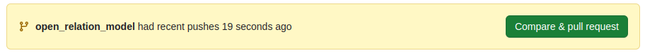
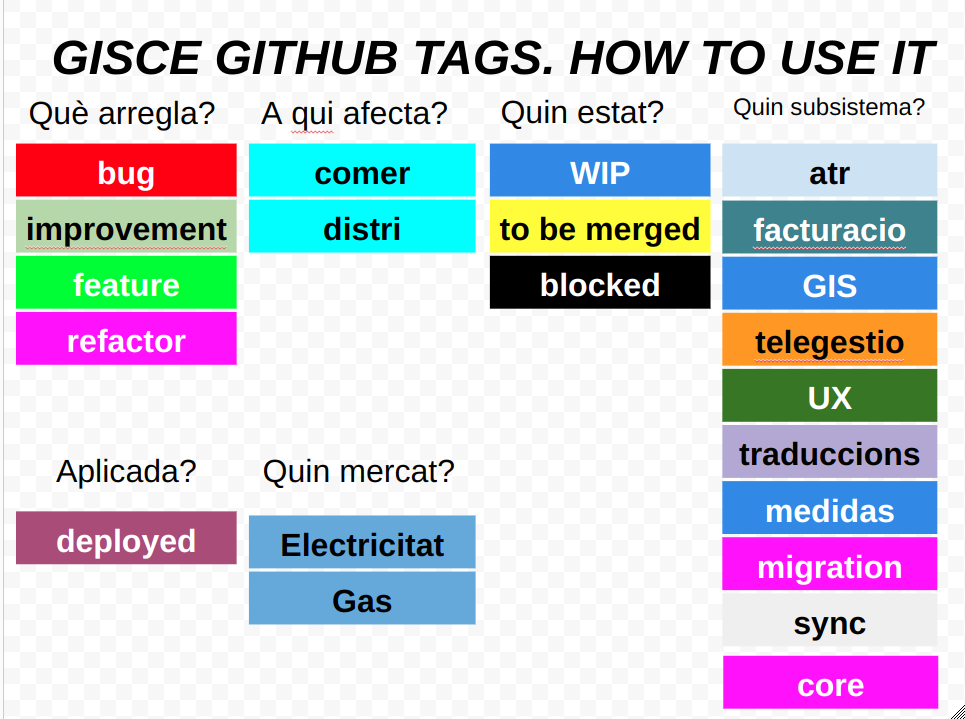
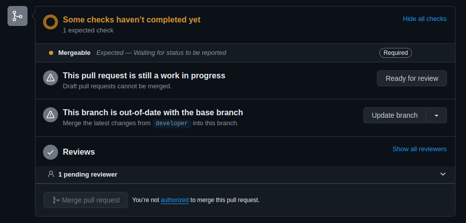

<!-- TOC INICIO -->
- [GIT](#git)
  - [COMMANDES ÚTILS](#commandes-útils)
  - [KEYGEN](#keygen)
  - [SSH Key](#ssh-key)
  - [AFEGIR COL·LEBORADOR](#afegir-colleborador)
  - [NEW BRANCH](#new-branch)
  - [ESTRUCTURES DE PASSOS PER UN "COMMIT"](#estructures-de-passos-per-un-commit)
    - [Atributs:](#atributs)
  - [DESHACER (git add .)](#deshacer-git-add-)
    - [LABELS](#labels)
  - [ACTUALITZAR BRANCA](#actualitzar-branca)
  - [BORRAR BRANCA](#borrar-branca)
  - [BORRAR CANVIS EN COMPTES D'EFEGIR-LOS (patch)](#borrar-canvis-en-comptes-defegir-los-patch)
  - [BORRAR STASH](#borrar-stash)
  - [RE-TEST GITHUB](#re-test-github)
  - [RESET](#reset)
  - [REMOTE](#remote)
    - [DIFF [BRANCH vs REMOTE]](#diff-branch-vs-remote)
  - [HISTÒRIC](#històric)
  - [MOSTRAR BRANCH (graph)](#mostrar-branch-graph)
  - [OBTENIR BRANCH MERGED](#obtenir-branch-merged)
  - [CANVIAR COMMIT](#canviar-commit)
      - [LAST COMMIT](#last-commit)
      - [COMMIT AFTER PUSH](#commit-after-push)
  - [UNTRACK FILE ADD PREVIOSlYS](#untrack-file-add-previoslys)
  - [MERGE Developer to current old branch](#merge-developer-to-current-old-branch)
  - [SOBRE ESCRIURE EL UN COMMIT](#sobre-escriure-el-un-commit)
  - [AFEGIR co-autor](#afegir-co-autor)
    - [FROM commit](#from-commit)
    - [EDIT commit](#edit-commit)
      - [EN COMMIT](#en-commit)
      - [AFTER  COMMIT](#after--commit)
  - [SEARCH FROM LOG](#search-from-log)
  - [REVERT](#revert)
  - [GIT MERGE Developer](#git-merge-developer)
  - [GIT MERGE CONFLICTS](#git-merge-conflicts)
    - [Fast-forward Merge](#fast-forward-merge)
    - [Recursive Merge](#recursive-merge)
    - [Octopus Merge](#octopus-merge)
    - [Manuals](#manuals)
    - [Fucionar els dos canvis](#fucionar-els-dos-canvis)
    - [Ours Merge](#ours-merge)
    - [Theirs Merge](#theirs-merge)
  - [TEMPLATE Pull Request](#template-pull-request)
<!-- TOC FIN -->

# GIT

## COMMANDES ÚTILS

> [WIKI](https://git-scm.com/docs)
 
## KEYGEN

> [DOC](https://docs.github.com/es/authentication/connecting-to-github-with-ssh/generating-a-new-ssh-key-and-adding-it-to-the-ssh-agent)

* ed25519
```bash
ssh-keygen -t ed25519 -C "your_email@example.com" 
```

* rsa
```bash
ssh-keygen -t rsa -b 4096 -C "your_email@example.com"
```

* init
```bash
eval "$(ssh-agent -s)"
# Agent pid 59566
```

* config
```bash
# create
touch ~/.ssh/config

# open
open ~/.ssh/config

# edit
vim open ~/.ssh/confi


# content
Host github.com
  AddKeysToAgent yes
  UseKeychain yes
  IdentityFile ~/.ssh/id_ed25519
  # Si decides no agregar una frase de contraseña a la clave, debes omitir la línea
  IgnoreUnknown UseKeychain
```

* Save on `keychain` [OPCIONAL]
```bash
# ed25519
ssh-add --apple-use-keychain ~/.ssh/id_ed25519

#rsa 
ssh-add --apple-use-keychain ~/.ssh/id_rsa
```

## SSH Key

* Settings
  * SSH
    * New one
      * Copia resultat de la comanda `cat ~/.ssh/id_rsa.pub`

## AFEGIR COL·LEBORADOR

* Settings
  * Col·laboradors
    * Add People
      * Busques User
        * Enviar Invitacio
          * Des de l'altre mail Acceptar
  
## NEW BRANCH

* `purpose`:
  * feature
  * bugfix
  
```bash
git checkout -b $purpose/your-new-branch
```

## ESTRUCTURES DE PASSOS PER UN "COMMIT"

* Per saber a quina versió de l'ERP ens trobem.
`git describe --tag`

* Validar branca i fitxers modificats
```
git status
```

* Actualitzar el HEAR amb delevoper
```
git fetch -pPf
or
git fetch --prune --prune-tags --force
```

* Actualitzar el fitxers amb els canvis de developer
```
git merge
or 
git pull (shortcut per fetch and merge)
```

* To abort a merge in Git, you can use
```bash
git reset --hard HEAD
or
git merge abort
```

* Actualitzem el link_addons
`python tools/link_addons.py`

* Si sabem que necessitem un modul concret validem que aquest s'ha intal·lat.
`ls server/bin/addons/ | grep <module_name>`

* Actualitzar el fitxers amb els canvis de la branca on es trobem
```
git pull origin <branch_name>
```


* Sortir des de la branca "developer"
````
git checkout developer
or
git checkout -b <nom_branca> origin/developer
````

<span style="background-color:green">`*OPCIONAl`</span>
Encas de tenir que guardar codi brut i canviar de branca.

```
git diff > nom_fitxer.diff
git stash -u[¹]
git checkout developer
git checkout -b <prefix_nom_branca> origin/developer
git stash pop
```

[¹]: `u`: Si cal guarda fitxer nous.

### Atributs:

* `prefix`: ID de la tasca.
* `nom_branca`: nom relacional a la tasca.

<span style="background-color:red">`En cas d'ERROR`</span>
```
git apply nom_fitxer.diff
rm nom_fitxer.diff
```

* Recorrer els fitxers modificats abans de fer el commit.
```
git add --patch
```

> `INSTRUCIONS` y/n/q/a

* Afegir arxius nous.
```
git add .

git add <path_file> <path_file>
```

* Netejar de fitxers "untracked".

* _fitxers_
```
git clean -f
```

* _carpeta recursiva_
```
git clean -r -d
``` 

* _rollback de fitxers_
```
git checkout nom_fitxer
``` 

* commit
  * `breaking_change`:
    * fix(pencil): Patch - Fix Release
    * feat(pencil): Minor - Feature Release
    * perf(pencil): Major - Breaking Release (Note that the BREAKING CHANGE: token must be in the footer of the commit)
```
git commit -m $breaking_change "<missatge>"
```

* pujar canvis a la PR _(Pull request)_
```
git push origin <nom_branca>
or 
git --set-upstream-to=origin/<branch_remote> <branch_local>
```

* Anar a el REPO de GITHUB i clickar `Comapare & pull request` or a la pull request.
  
    * Editar títol i descripció.
    * Editar menú de l'esquerra.
      * Reviwers <span style="background-color:red">`*IMPORTANT`</span>
      * Assignees <span style="background-color:red">`*IMPORTANT`</span>
      * Labels
        * WIP
        * deployed
        * ...
        * (local run) to be merged
          * <span style="background-color:red">`*IMPORTANT`</span> DIFF 
          * (local run) to be merge ("PERUANO" no preguntar): Testos en local GRATÜIT
          * to be merge: Testos Github PAGAMENT
      * Milestone <span style="background-color:red">`*IMPORTANT`</span>

## DESHACER (git add .)

```bash
git reset
```

### LABELS

Com aplicar els labels



## ACTUALITZAR BRANCA 

`git pull origin <branch_name>`

Si volem fer un `UPDATE` de developer podem anar el `GITHUB` i desde allà podem fer `UPDATE BRANCH`




## BORRAR BRANCA

`git branch -d <branch>`


## BORRAR CANVIS EN COMPTES D'EFEGIR-LOS (patch)

`git checkout --patch`


## BORRAR STASH

`git stash drop`

## RE-TEST GITHUB

Per tornar a fer els TESTOS després d'un commit s'ha de treure el `label` (local run) to be merge. Aaquest automàticament torna a executar els TESTOS.

* Ready to review
* Treure `label` (local run) to be merged.


## RESET

```
# Reset
git reset HEAD^ --hard
or 
git reset <commit>

# Força canvis
git push origin <nom_branca> --force
``` 

* Es pot borrar fitxers que encaren estan pendent de commitaja després de fer un reset.
`git clean -fdx`

* tiran endarrera el punter (HEAD)

`git reset <num_commit>` (el punter el torna al commit desitjat) * no toca fitxes.

* Guarda

`git stash`

* Descarga les mofidificación de Github
`git fetch -pPf`

* sync branch to develop branch

`git reset --hard origin/<branch>`

* Fem un push per deixar local igual que git
`git push --force origin <branch>`

* recuprar canvis

`git stash pop`

* afegir modificacions d'arxius.

`
git add --patch
or
git add -p
`

* afegir arxius nous.

```
git add .

OR

git add <file_path>
```

* commit

* `git commit -m ""`

* borrar el commit de develop fin la current branch.
    * :warning: MILLOR NO TENIR QUE FER-HO. NOMÉS SI HI HA MOLTS "PETES".
    * :warning: Només si no s'ha desplegat i no hi ha commit de ningú altre.


## REMOTE

Son las diferentes copias que se pueden tener de un repositorio en tu PC definiendo un nombre para diferenciarlas. 
Para verlo más claro vamos con un ejemplo.

* `git remote --verbose`: Este nos muestra los distintos repositorios (URL-REPOSITORY) que tenemos en nuestro local

> origin <URL-REPOSITORY>
> 
> origin <URL-REPOSITORY>
> 
> eGarrigaG <URL-REPOSITORY>
> 
> David <URL-REPOSITORY>

Que significa todo esto:

La primera columna nos sirve para dar nombre a la copia del repositorio. Podemos tener tantas copias como queramos.

Git nos pone por defecto `origin`, pero podemos dar otro nombre con _git remote **add**_

### DIFF [BRANCH vs REMOTE]

La diferencia entre `branch` y `remote` es que:

* Branch → Es como hacer una copia de tu `codigo` dentro del mismo `repositorio`. Ahora tienes dos versiones del `codigo` en el mismo 
 `repositorio`, pero aún está todo en tu casa. Puedes probar cosas en una sin cambiar la otra.

* Remote → Es como tener una copia de todo tu `codigo`. Si haces cambios en casa y los envías, el `repositorio` también los tendrá. 
  Y si alguien cambia algo en el `repositorio`, puedes traerlo a tu `repositorio`.


## HISTÒRIC

`git reflog` 

## MOSTRAR BRANCH (graph)

* instal·lar.

`sudo apt install tig`

* constultar

`tig`

## OBTENIR BRANCH MERGED 

Obtenirm un llistat de les branques que ja esta merged a (master | main | developer) d'aquesta manera podem borrar-les de forma local.

```
git branch --merged | grep -v "(^\*|master|main|developer)"s
git branch -D <branch>
```

## CANVIAR COMMIT

:warning: NOCOMPLICAR-SE LA VIDA AMB `--amet` :warning:

En algunes circumstancies necessitarem canviar el commit. 

#### LAST COMMIT

Si es just després de fer el commit en el que encara no hem fet ni un altre commit ni un push podrem editar-lo de les següents dues maneres:

* Directament des de commit
```gitexclude
git commit --amend -m "New commit message"
```

* Obrin un editor i modificant el commit allà. (Això també és fa per editar el co-author, etc...)
```gitexclude
git commit --amend
```

#### COMMIT AFTER PUSH

Per fer-ho necessiterem executar la commanda `git commit --amet` i un cop realitzat els canvis farem un push force `git push --force origin <branch>`

## UNTRACK FILE ADD PREVIOSlYS

Algunes vegades afegim un fitxer o per error o que no volem pujar en aquell moment per treurel de la llista abans del `commit` podem fer:

`git reset <file_path>`

## MERGE Developer to current old branch

Es possible que un branca antiga oberta estigui que modificar codi, amb el temps el codi de `developer` 
haura canviat així que haurem d'obtenir aquest codi en local primer i després pujar aquest a la branca en la que treballem.

Aquesta pujada `push` es pot fer un cop el codi estigui generat i pujar amb el mateix commit o pujar-lo primer per tenir-lo el dia.

* Merge desde la branca en qüestio.
```
git fetch -pPf
git merge origin/developer
```

* Actualitzem el link_addons
`python tools/link_addons.py`

* Si sabem que necessitem un modul concret validem que aquest s'ha intal·lat.
`ls server/bin/addons/ | grep <module_name>`

* Arreglar possibles conflictes

* Mostrar els fitxers afegits o modificats `git status` > 

* Afegir els fitxers indicats `git add <files>`

* Commit dels canvis, però sense missatge. Aquest agafarà el perdefecte del `Merge`
  * `git commit --no-edit`

* git push origin <branch>


## SOBRE ESCRIURE EL UN COMMIT

Si pujem fitxers amb algun error o cambi respecta el commit anterior no cal que fem un nou commit podem sobre escriure'l

```
git commit --amend --no-edit
git push origin <branch_name> --force
```

## AFEGIR co-autor

### FROM commit

```gitexclude
git commit -m "Missatge commit


Co-authored-by: Ferran Capallera <fcapallera@gisce.net>"
```

### EDIT commit

#### EN COMMIT

git commit -m "Refactor usability tests. > > Co-authored-by: name <name@example.com> Co-authored-by: another-name <another-name@example.com>"

#### AFTER  COMMIT

* Editem el commit
```
git commit --amend --edit
```

* En el fitxer afegim el co-author
```
..
Missatge commit
> ** 1 enter
> ** 2 enter
Co-authored-by: [name] [<email>]
```

* Pujem els canvis (--force només si ja s'havia fet un push anterior)
```
git push origin <branch_name> --force
```

## SEARCH FROM LOG

```bash
git log --all --grep='commit message'
```

## REVERT

```bash
git revert <commit>
git status
git push origin <branch>
```

* Per fer-ho varies vegades no farem commit  cada cop
```bash
git revert <commit> -n
git status
```

> Si esta aplicat algún servidor s'haurà de borrar la carpera patches

## GIT MERGE Developer

Algun conflictes poden apareixe entre branca i developer. Per resoldre els conflictes seguirem els següents passos:

* `git fetch -pPf` de la branca
* `git merge origin/developer`
* `git add <file>` dels fitxers modificats
* `git commit` sense missatge
* `:q` per tancar el fitxe de commit que ens apareix que per defecte porta la descripció del `merge`
* `git push origin <branch` per últim pujem el canvis


## GIT MERGE CONFLICTS

El primer que es pot fer es aborta el commit i intentar resoldre el conflicte si sabem que es un cosa sencilla.

* `git merge --abort`

El merge es realitza de la branca que li passem per paramentre cap a la branque en la que ens trobem

* from my-branch => `git merge their-branch`

Després de fer un Merge pot succeir que tinguem conflictes amb els fitxers del nostre local i del repositori. 
Per resoldre els conflictes ho podem fer de varies maneres:

* `Fast-forward`: Cuando no hay cambios en la rama de destino después de la separación. 
* `Recursive`: Fusión estándar cuando hay cambios en ambas ramas.
* `Octopus`: Para fusionar más de dos ramas a la vez.
* `Manualment`: La més comuna, ja que mantenim el control sobre el que volem quedar-nos i el que volem omit.
* `Their`: Aquest sobre escriu tot el fitxer amb el codi de la branca d'origen. Un cop fet s'ha de marca amb git add que els canvis esta realitzats i fer un commit amb els canvis, pel que el codi local queda canviat aprtir d'aquí
* `Ours`: Aquest manter el codi del fitxer amb el codi local. Un cop fet s'ha de marca amb git add que els canvis esta realitzats i fer un commit amb els canvis, pel que el codi origen queda modificat pel local

### Fast-forward Merge

Este tipo de merge ocurre cuando la rama de destino no tiene ningún commit nuevo desde el punto en que ambas ramas se separaron. 
Es decir, si la rama que quieres fusionar tiene cambios que se pueden aplicar directamente al final de la rama de destino, Git 
simplemente **mueve el puntero** de la rama de destino hacia adelante, sin necesidad de un commit adicional. 

Es como si simplemente avanzaras la historia de la rama de destino. 

```bash
# Estás en la rama main y tienes la rama feature.
git merge feature
```

### Recursive Merge

El merge recursivo es el que se usa cuando Git necesita fusionar ramas que han avanzado de forma independiente. Es el tipo de merge 
por defecto cuando **ambas ramas tienen commits nuevos y han divergiendo**. 
En este caso, Git intenta fusionar ambas ramas de forma automática, y **si hay conflictos**, los muestra para que el usuario los 
resuelva manualmente. 

```bash
# Estás en la rama main y tienes la rama feature.
git merge feature
```

### Octopus Merge

Este tipo de merge es menos común y se usa **cuando se fusionan más de dos ramas al mismo tiempo**. Este merge intenta combinar varias ramas en una sola. 
Si las ramas no tienen conflictos, el merge será automático, pero si hay conflictos, se necesitarán resoluciones manuales. 

```bash
git merge rama1 rama2 rama3
```


### Manuals

Aquest marca els conflictes de la següent manera per fasilitar-nos la seva edició

```
<<<<<<< HEAD
this is some content to mess with
content to append
=======
totally different content to merge later
>>>>>>> new_branch_to_merge_later
```

* `<<<<<<< HEAD`: actual canvis (ours). Sempre tenin en compte la branca en la que estem
* `=======`: Divisior del conflicte
* `>>>>>>> new_branch_to_merge_later`: canvis que entren (their). Sempre tenein en compte la branca que estem integran

### Fucionar els dos canvis

Pot ser que els conflictes vinguin de tocar la mateixa línea. Això es resoldra crean una nova línea de forma manual que integri els 
dos canvis i eliminarem tan el `HEAD`  com el `new_branch_to_merge_later`.


### Ours Merge

La estrategia ours se usa para indicar que, **en caso de conflicto, se eligen los cambios de la rama actual**, ignorando los de las 
ramas a fusionar.

```bash
git merge -s ours feature
```

### Theirs Merge

La estrategia theirs es **lo opuesto a ours**, es decir, en caso de conflicto, Git elegirá los cambios de la rama que estás fusionando,
dejando de lado los de tu rama actual.

```bash
git merge -s theirs feature
```

## TEMPLATE Pull Request

Através d'un fitxer `.md` Github crearà una `Conversation` amb el que hi ha en ell

* Crear carpeta oculta [.github]
* Crear fitxer template [pull_request_template.md]
