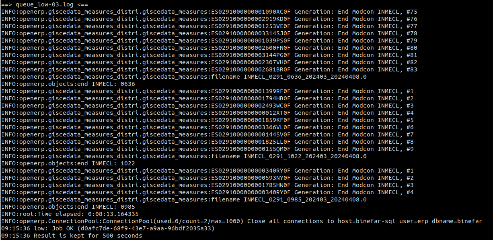

<!-- TOC INICIO -->
- [QUEUE](#queue)
  - [Creació](#creació)
  - [Config del worker](#config-del-worker)
  - [Validar](#validar)
    - [Atribut:](#atribut)
  - [VEURE logs](#veure-logs)
<!-- TOC FIN -->

# QUEUE

## Creació

Decorador amb els seus params:
  * `queue`: name_job
  * ...
```python
@MulpiprocessBackground | @job
def any():
```

## Config del worker

Dintre el servidor anirem a la carpeta de configuració del supervisrctl:
```bash

```

* Total workers: Dependrà del total de nuclis i `queue` que tinguem. No podem sobre pasa el total sumal totes les cues. 
* Name file log:
* Path del log: 
* etc ...


## Validar

`rq info -Q -i <segons>`

* Entrem com usuari `erp`
```bash
sudo su - erp
```

* Mostrem les cues i el workers
```bash
rq info
```

* Mostrem només les cues
```bash
rq info -Q 
```

* Mostrem només els workers
```bash
rq info -W
```

* Mostrem només els workers i les cues
```bash
rq info -R
```

* Fem que reinici cada n segons
```bash
rq info -i <N> 
```

rq info -R -i <N> <queue_name> <queue_name> ...

### Atribut:

* `rq`: Default command `Redis Queue`
* `info`: Mostra la informació sobre les queue
* `-Q`: Llista només les queue
* `-i`: Actualització
* `segons`: (integer) Quantitat de segon que tardarà en actualitzar-se si s'ha definit el tag `-i`
* `queue_name`: Nom de la cua que volem veure especificament. Poden ser varies


## VEURE logs

Des de usuari `erp`

```
tail -f queue_low-*
```

