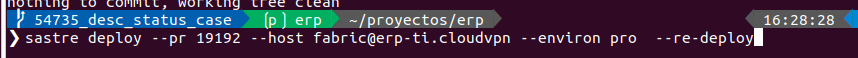
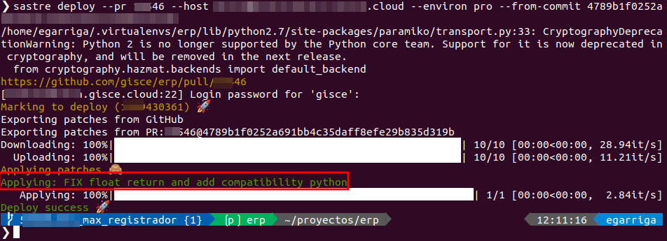

<!-- TOC INICIO -->
- [SASTRE](#sastre)
  - [QUE ÉS? PER A QUÈ SERVEIX?](#que-és-per-a-què-serveix)
  - [ACTUALITZAR SASTRE](#actualitzar-sastre)
  - [PASSOS](#passos)
    - [INSTAL·LAR](#installar)
    - [EXECUTAR](#executar)
    - [EXECUTAR EN LOCAL](#executar-en-local)
      - [Atributs:](#atributs)
  - [DEPLOY SUCCESS](#deploy-success)
  - [ERRORS](#errors)
    - [GIT AM _(session)_](#git-am-_session_)
    - [DEPLOY FAILURE](#deploy-failure)
      - [AS-DIFF + REJECT + SKIP-ROLLING-CHECK _(Markus)_](#as-diff--reject--skip-rolling-check-_markus_)
      - [--AM _(David)_](#--am-_david_)
  - [ACTUALITZAR PROJECTS (v**.*-minors)](#actualitzar-projects-v-minors)
    - [Accions](#accions)
    - [SSH](#ssh)
    - [Validem](#validem)
<!-- TOC FIN -->

# SASTRE

## QUE ÉS? PER A QUÈ SERVEIX?

Eines per aplicar sol·licituds d'extracció als servidors mitjançant `git format-patch` i `git am`. 

Està integrat amb la nova API de desplegament de GitHub.

## ACTUALITZAR SASTRE

Ens col·loquem a l'entorn erp

```bash
pip freeze | grep -i apply-pd
&& 
pip install --upgrade apply_pr
```

## PASSOS

* Desde ENTORN `ERP`
` workon erp `



### INSTAL·LAR 

`pip install --upgrade apply_pr`

### EXECUTAR

Sempre anira primer `sastre deploy`

* Base. Primer com que es fa el `sastre` per un `PR` nova
```bash
sastre deploy --environ *** --host user@host --pr link_git_hub_amb_commit 
```

:@polSala: aquesta manera ens assegura que no ens oblidem d'assingar els tags
* `--repository`
* `--pr`
* `--from-commit`

> També

```bash
sastre deploy --environ pro --repository erp --host fabric@erp-ti.cloudvpn --pr 19241
``` 

* Si ja em fet un `sastre` previament i no hi ha hagut cap commit entre mitg d'una altre usuari pode ajecutar el `--re-deploy`
Això buscarà l'últim commit en els patches i executarà a partir d'aquest.
```bash
--re-deploy
```

* Si ja em fet un `sastre` previament, però hi ha hagut commit per altres usuaris no entre el `--re-deploy` per altres raons
partirem des de un commit concret
```bash
--from-commit 678cf5ff5b71bf37c6dae7f0a8c89a0090068599
```

* Si hi ha conflictes. Farem un `diff` i que ens crei els rejects en la carpeta `patches`. :IMPORTANT: Només si no s'ha aplicat amb anterioritat cap commit
  Si ja s'ha desplegat un commit en anterioritat fallarà, ja que el fitxer diff contindrà codi ja pujat.
```bash
--as-diff --reject 
```


### EXECUTAR EN LOCAL

```bash
sastre deploy --environ test --sudo_user egarriga --pr xxxx --host egarriga@localhost --src /home/egarriga/proyectos/ --skip-rolling-check --reject --as-diff 
```

#### Atributs:

* Base
  * `--environ` Enviroment: [PRO | PRE | TEST]: Tag que es mostrarà en GitHub
  * `--repository`: Per defecte es `erp`. Per exempre seria `--repository ecasa-modules`
  * `--host` Servidor on es vulgui desplegar.
  * `--pr` Número PR de github.

* Commit
  * `--re-deploy` [opcional] A partir de l'últim commit que es va desplegar el servidor. Només funciona si ningú a fet un altre commit.
  * `--from-commit` [opcional] a partir del commit indicat en endavant (sempre que no s'hagi executat com a `--as-diff`)

* Conflictes
  * `--as-diff` [opcional]  Agafa el fitxer diff i ho intenta aplicar tot. :IMPORTANT: Només si no s'ha aplicat amb anterioritat cap commit
  Si ja s'ha desplegat un commit en anterioritat fallarà, ja que el fitxer diff contindrà codi ja pujat.
  * `--reject` [opcional] (--as-diff) Deixar arreglar els conflictes de commit.
  * `--auto-exit=False` [opcional] No tira endarrera la sequència. Deixat els canvis aplicat en un patch per poder ser modificats en el servidor.

* Update
  * `--update` [opcional] Per actualitzar les vistes totals d'un mòdul. _(s'ha d'anar molt amb compte)_

* Entorn `local`
  * `--src` carrega del projecte. És necessari que sigui `erp`
  * `--skip-rolling-check` No té en compte la branca rolling


## DEPLOY SUCCESS



Desde GITHUB `PR`

* Mirar el final si el commit estar "deployed to <servidor>  timestamp `ACTIVE`"


## ERRORS

### GIT AM _(session)_ 

El sastre utilitza el `git am` per fer el desplegament.

Ens podem trobar que algú estigui desplegant o que el nostre desplegament falli. Això provocarà un error de sessió `The repository is in the middle of an am session!`

Per resoldre'l haurem de fer un `git am --abort`

Amb `git am --show-current-patch` podem veure que s'està aplicant:


[details="Exemple"]
```
From dc987ea46c5d34400091dcaeb5b24e28e8c148bc Mon Sep 17 00:00:00 2001
From: eGarriga <egarriga@gisce.net>
Date: Mon, 11 Mar 2024 10:16:47 +0100
Subject: [PATCH] =?UTF-8?q?Hacer=20visible=20y=20no=20modificable=20la=20?=
 =?UTF-8?q?=C3=BAltimas=20lecturas=20de=20comptador.?=
MIME-Version: 1.0
Content-Type: text/plain; charset=UTF-8
Content-Transfer-Encoding: 8bit
```
[/details]


### DEPLOY FAILURE

#### AS-DIFF + REJECT + SKIP-ROLLING-CHECK _(Markus)_

Per local i possiblement per deploy igual en un `projecte`.

* Terminal
  * git checkout vxxx.x
  * git fetch -pPf
  * git merge origin/vxxx.x or git pull
  * python scripts/apply_commits.py --pr yyyy
* Nou [TAB] terminal. Si hi ha algun conflicte.
  * git status
  * vim [nom fitxer/s amb conflicte] -> Solventar els conflictes
  * git add [nom fitxer/s]
  * git push origin vxxx.x
* Anar a la PR i marcar la branca com a 'Done'


####  --AM _(David)_

Executem el sastre normalment i peta per conflictes.

En col·loquem el `servidor` del client

Obrim un `tmux` 

En podem com a usuari erp `sudo su - erp`

Ens col·loquem a el directory: `cd src/erp/`

* passos per cada `PATCH`
  * git am patches/<pr>/<...patch> [--reject]
    * git status
    * Si no em fet el --reject
      * Si falla
      * git apply --reject patches/<pr>/<000...patch>
        * git status
      * vim -O <file> <file.rej>
      * rm <.rej>
      * git status
      * Amb molt de carinyo. amb la PR al constat segons el Commit on estem
        * git add <file_to_add>
        * git add -p
        * git am --continue
  * Seguim amb el següent patch fins que entrin tots.
    * Si torna a falla torneme el pass del git apply i git am --continue per fet el commit
  * Un cop tots acabats farem
    * Farem un `sastre status id_deploy`, perque ho marqui a la PR com a ACTIVE.

## ACTUALITZAR PROJECTS (v**.*-minors)

Des de Github seguim aquests passos per tal de veure quines PR tenim pendents d'entrar a branques:

> * Repositori [erp]
>  * [TAB] Project
>    * [branch]
>      * [TABS] ERROR | PENDANT INTEGRAR


Quan un Keepup passa mira tot el que esta a `v**.*-minors` i ho actualitza a tots els servidors que tenen aquestes branques de minors.

Per que aixó entri a les branques abans del merge d'una `PR` s'ha haver afegit en la PR del Github els tags de `Projects` en quines minor s'aplicar

Aquestes si s'han actualitzat correctament es possarant en `Done` si no en `Error` que serà quan haurem de realitzar un fix d'aquest en el servidor que hagi fallat

### Accions

Al igual que utilitzem el `sastre` per pujar una branca a un servido per poder validar el seu comportament. 
La publicació de la PRa una minor és fa quasi de la mateixa manera.

* Checkout a la branque minors que toca

* Actualització a la branque 
```
git fetch -pPf
git pull
```

* Aplicar la següent comanda de `sastre`
```bash
sastre deploy --environ pro --repository erp --src /home/egarriga/proyectos/ --host egarriga@eGarriga --sudo_user egarriga --skip-rolling-check --as-diff --reject --force-hostname v**.*-minors --pr num_PR

# Contrassenya del PC
```

<details>
<summary>POSSIBLES ERROR</summary>

### SSH

* Validar ssh local activate
```bash
ps ax | grep ssh

# Expect sshd 
# > sshd: /usr/sbin/sshd -D [listener] 0 of 10-100 startups
```

* Activar ssh local
```bash
sudo systemctl start ssh.s
```

* Activar al reinicia PC
```bash
sudo systemctl enable ssh.service 
```

</details>


* Validem
```bash
git log
```

* Un cop aplicada correctement, i no queden més PR en la branca

```bash
git push origin v**.*-minors
```

* Sin tot ha anat bé marquem el `Github > Projects` la branca minor com a `Done`

### Validem

* Des de Github PR *
  * Files [TAB]
    * Show file
      * Buscar `branch`
        * Ens fiquem en node `Blame`
          * Validem que s'ha fet un `push` fa relaticament poc de l'usuari `eGarriga`