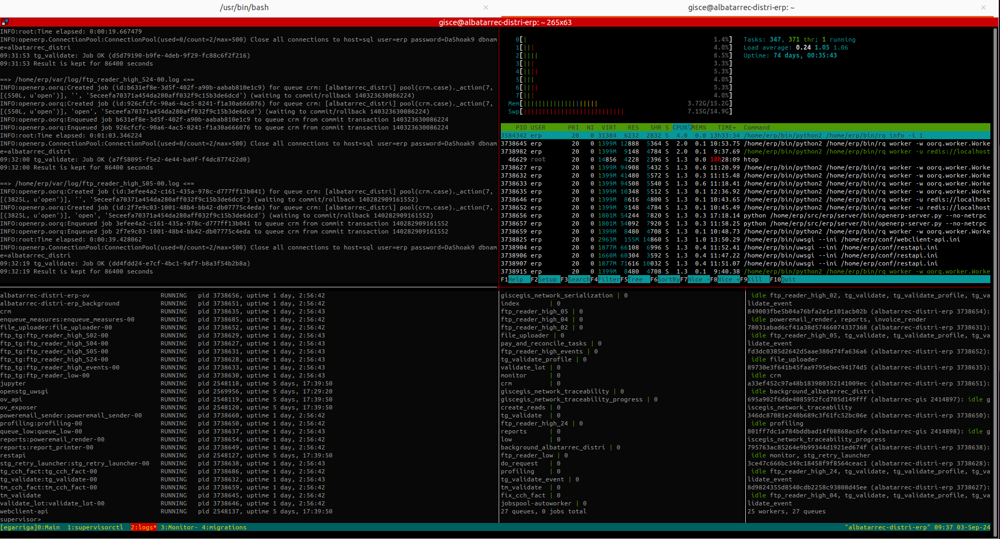
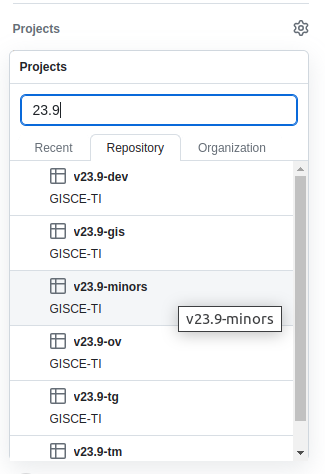
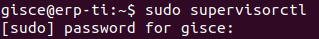
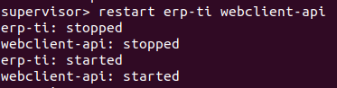
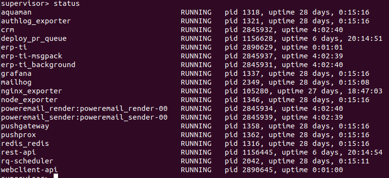

<!-- TOC INICIO -->
- [SERVER](#server)
  - [AFEGIR CLAU SSH](#afegir-clau-ssh)
  - [OBRIR UN NOU PORT](#obrir-un-nou-port)
  - [MONITORITZAR SERVIDOR](#monitoritzar-servidor)
    - [Cues i Workers](#cues-i-workers)
      - [Atribut:](#atribut)
    - [LOGS CUES](#logs-cues)
    - [SUPERVISORCTL](#supervisorctl)
  - [REINICIA SERVIDOR](#reinicia-servidor)
    - [PASSOS](#passos)
    - [RESTART](#restart)
    - [OOPGRADE](#oopgrade)
  - [PATH FILES](#path-files)
  - [INSTALL .DIFF DEVEOPER TEST](#install-diff-deveoper-test)
<!-- TOC FIN -->

# SERVER

Entra com usuari erp

```
sudo su - erp
```

## AFEGIR CLAU SSH

```bash
cat ~/.ssh/id_rsa.pub
```

## OBRIR UN NOU PORT

* Anar el path
`cd src/erp`

* Obrim un nou ERP a través d'un port en paral·lel
`python /home/erp/src/erp/server/bin/openerp-server.py --no-netrpc --price_accuracy=6 --config=/home/erp/conf/hidrocabrera.conf --port 4444 --interface=0.0.0.0`

* `interface`: ???
* `port`: Obre un nou ERP en el port definit

* Validar que el process esta corrent correctament 
`Server started in ...`

* Un cop validats els canvis. Matar el process
`CTRL+C`

  
## MONITORITZAR SERVIDOR

### Cues i Workers




<details>
<summary>És possible que la màquina del Redis no es trovi a la mateixa màquina que l'ERP. Per s'haver-ho pho podem fer de dues maneres</summary>

* OPCIÓ 01. Des de el fitxer de configuració de l'ERP
```bash
cd config

cat <distri>.config
```

* OPCIÓ 02. Des del fitxer /atc/hosts
```bash
cat /etc/hosts
```

* Després ho correm amb `-u` que serà l'alias
```bash
rq info -u redis://redis/0 -i 5 -Q 
```

</details>


* Entrem com usuari `erp`
```bash
sudo su - erp
```

* Mostrem les cues i el workers
```bash
rq info
```

* Mostrem només les cues
```bash
rq info -Q 
```

* Mostrem només els workers
```bash
rq info -W
```

* Fem que reinici cada n segons
```bash
rq info -i <segons> 
```

#### Atribut:

* `rq`: Default command `Redis Queue`
* `info`: Mostra la informació sobre les queue i workers
* `-Q`: Llista només les queue
* `-i`: Actualització
* `segons`: (integer) Quantitat de segon que tardarà en actualitzar-se si s'ha definit el tag `-i`


### LOGS CUES

```bash
sudo su - erp
```

```bash
tail -F ~/var/log/<log>
```

### SUPERVISORCTL

* usuario supervisorctl
```bash
sudo supervisorctl
```

* LLista <???>
`status`

```bash
tail -F <???>
```

## REINICIA SERVIDOR

És pot reinicia de dues maneres:

* supervisorctl
  * `restart`
* Mòdul
  * `oppgrade`

### PASSOS

> Desde TMUX 'MILLOR'

`ssh <host>@<servidor>`

> <span style="background-color:red">`IMPORTANT`</span>
> 
> Avisar als companys si es per **ERP-TI** en desenvolupament corrent. 
> 
> Si és per **CLIENT** esperem tan com podem a la tarda. 
> 
> Si volem que entri a les **QUEUE** nocturnes a d'estar a una branca de desenvolpament de la versió actual <'23.9'>.
>
> Per saber quina **QUEUE** és:
> 
> 


### RESTART

Desde **SUPERVISORCTL** utilitzant la comanda `restart` per procesos especifics.

* Entrem el supervisor

```
sudo supervisorctl

pwd:
```



* Executem la comanda per llistar tots els processos

`status`

* Executem la comanda per reinicia els procesos.

```
restart <proces> <proces>
```

* erp
* backgrounder
* webclient-api



* Validem que s'ha reiniciat.

`status`




### OOPGRADE

Desde **SERVIDOR** utilitzant del mòdul `oopgraade` de manera massiva. 

:warning: Aquest matar tots els servidors i processos.

* Entrem com usuari `erp`

` oopgrade --config=/home/erp/conf/<name_config_file>.conf pubsub --channel all harakiri `

> * `pubsub`: tots els canals subcrits a `harakiri` es reinician.
>
> * `--channel`: definir canal que volem reiniciar.
>
> * `harakiri`: comanda a cridar.


## PATH FILES

`ERP LOCAL` => /home/`egarriga/proyectos/`erp/addons/gisce/GISCEMaster/giscedata_cnmc_circular_8_2021/wizard/wizard_circular_8_2021_view.xml

`ERP CLIENT` => /home/`erp/src/`erp/addons/gisce/GISCEMaster/giscedata_cnmc_circular_8_2021/wizard/wizard_circular_8_2021_view.xml


## INSTALL .DIFF DEVEOPER TEST 

Quan realitzem canvis a en mòdul i és vol instal·lar testejar a un servidor PRO o PRE ho farem de la següent manera:

* Intal·lar:
  * Realisem un `.diff` de la `PR`   
  * Accedim al servidor 
  * Accecutem un git apply del fitxer `git apply <path_file>`
    * Si no el tenim. Creem un fitxer temporal el servidor i hi compiem el fitxer
  * Ens col.loquem en l'arrel del repositori
  * Implementem els canvis `pip install -e .`
  
* Tornem els fitxers els originals:
  * Desepliquem els canvis `git checkout <fitxers>`
  * Instal·lem els fitxers originals `pip install powerprofile`

Documentació sobre [PIP](https://pip.pypa.io/en/stable/cli/pip_install/)
