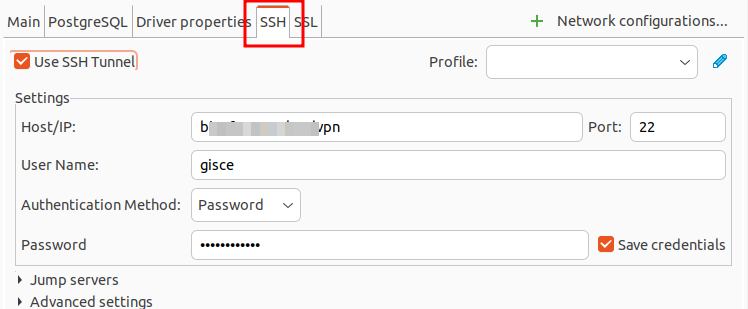
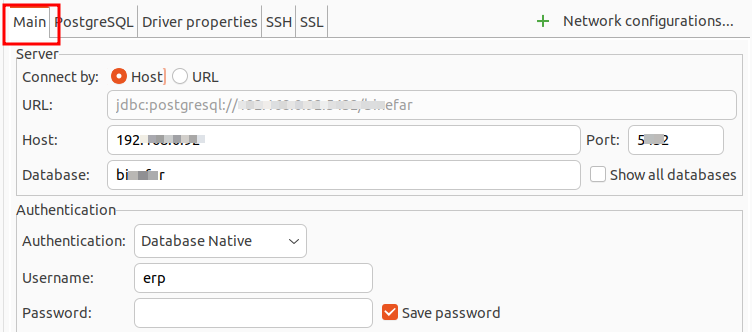

[//]: <> (order:asc)

<!-- TOC INICIO -->
- [COMMANDS](#commands)
  - [SET DEFAULT TERMINAL EDITOR](#set-default-terminal-editor)
  - [KEY COMBINATION](#key-combination)
  - [SPLIT WINDOW](#split-window)
  - [INDENTIFICAR UNIDADES DE TU PENDRIVE](#indentificar-unidades-de-tu-pendrive)
  - [APPEND TO FILE](#append-to-file)
  - [AÑADIR USUARIO A GRUPO](#añadir-usuario-a-grupo)
  - [FICHERO TAR](#fichero-tar)
  - [DESENPAQUETAR](#desenpaquetar)
  - [ZIP2](#zip2)
  - [CHECK SHELL I AM USING](#check-shell-i-am-using)
    - [SWITCH TO BASH](#switch-to-bash)
    - [SWITCH TO ZSH](#switch-to-zsh)
  - [REMOURE DE BLACK LIST SERVE PER ACCESS D'INTENTS](#remoure-de-black-list-serve-per-access-dintents)
  - [CHECK IP](#check-ip)
  - [CREAR SOFT LINKS QUAN ES CREA UN MÒDUL NOU](#crear-soft-links-quan-es-crea-un-mòdul-nou)
  - [Informació del PC _(cup, ram, ...)_](#informació-del-pc-_cup-ram-_)
  - [SWAP](#swap)
    - [CONFIG](#config)
    - [NETEJAR SWAP](#netejar-swap)
  - [CREAR UNA CONECCIO SSH](#crear-una-coneccio-ssh)
  - [CREAR UN TUNNEL](#crear-un-tunnel)
    - [DBEAVER](#dbeaver)
    - [COMMAND](#command)
  - [Check ubuntu release](#check-ubuntu-release)
  - [Create SSH key](#create-ssh-key)
  - [List](#list)
    - [User](#user)
    - [Package](#package)
  - [VARIABLES DE CONFIGURACIÓN](#variables-de-configuración)
    - [MOSTRAR](#mostrar)
    - [CREAR/ESCRIBIR](#crearescribir)
  - [Process](#process)
  - [Devices & Space](#devices--space)
      - [Atributs](#atributs)
  - [Libreries instal·lades de python](#libreries-installades-de-python)
  - [Packages](#packages)
  - [Version](#version)
  - [Logs](#logs)
  - [Create folder with specific size](#create-folder-with-specific-size)
  - [Execurtar Python](#execurtar-python)
  - [Append on a file](#append-on-a-file)
  - [Que Shell Usamos](#que-shell-usamos)
  - [Define Default SHELL](#define-default-shell)
    - [Restart SHELL](#restart-shell)
  - [Execurtar màquina vistual](#execurtar-màquina-vistual)
  - [GREP](#grep)
    - [GREP EN FITXER COMPIMIT BZ2](#grep-en-fitxer-compimit-bz2)
  - [LOOP](#loop)
  - [TRANSFERECIA DE FITXERS DE FTP A MÀQUINA LOCAL](#transferecia-de-fitxers-de-ftp-a-màquina-local)
    - [Copy Files and Directories Between Two Systems with scp](#copy-files-and-directories-between-two-systems-with-scp)
      - [Local to Remote](#local-to-remote)
      - [Remote to Local](#remote-to-local)
      - [Copy a File Between Two Remote Systems using the scp Command](#copy-a-file-between-two-remote-systems-using-the-scp-command)
  - [COPY FILES](#copy-files)
<!-- TOC FIN -->

# COMMANDS

## LIST OF MAC APPLICATION

```bash
ls /Applications 
```

### ADD TO FILE

```bash
ls /Applications > Desktop/applications.txt 
```

## COUNT LINE ON FILE (WC)

```bash
wc -l Desktop/applications.txt
```

* atributs `wc`:
  * `-l`: Count lines
  * `-w`: Count words
  * `-c`: Count bytes
  * `-m`: Count characters

## SET DEFAULT TERMINAL EDITOR

```bash
sudo update-alternatives --config editor
```

## KEY COMBINATION

* `Ctrl + arrow`: Jumps word

* `Ctrl + C`: Kills the currently running command and returns the user to the command line.
* `Ctrl + G`: Quits reverse or forward search, through the bash history.
* `Ctrl + R`: Recalls the last command, allowing the user to edit and re-execute it.
  * To search next press the command again and again
* `Ctrl + L`: Clears the screen, erasing all output.
* `Ctrl + K`: Deletes text from the cursor to the end of the line.
* `Ctrl + U`: Deletes text from the beginning of the line to the cursor.
* `Ctrl + W`: Deletes the word before the cursor.
* `Alt + D`: Delete the word previus the cursor.

* `Ctrl + Z`: Suspends the currently running command, allowing the user to resume it later using the fg or bg command.
* `Ctrl + S`: Pauses all command output to the screen, allowing the user to scroll through previously displayed output.
* `Ctrl + Q`: Resumes output to the screen after pausing it with `Ctrl+S`.

## SPLIT WINDOW

* `CMD + D`: horitzontal
* `CMD + SHIT + D`: vertical
* `CMD + ALT + ARROW`: moverse por las ventanas

## INDENTIFICAR UNIDADES DE TU PENDRIVE

```bash
lsblk
```

## APPEND TO FILE

```bash
echo some text >> path/file
```

## AÑADIR USUARIO A GRUPO

```bash
sudo groupadd docker
sudo gpasswd -a $USER docker
```

## FICHERO TAR 

* Comprimir
```bash
tar -tvf archive.tar.gz
```

* Descomprimir
```bash
tar -xvf archive.tar.gz
```

## DESENPAQUETAR

* Para desenpaquetar ficheros `.deb`
```bash
sudo dpkg -i <package>
```

## ZIP2

* Extraer
```bash
bzip2 -dk filename.bz2
```

* Descomprimir
```bash
bzip2 -d filename.bz2
```

* Comprimir
```bash
# Multiple files
bzip2 dir/*
# Single file
bzip2 filename
```

## CHECK SHELL I AM USING

```bash
echo $0
```

### SWITCH TO BASH

```bash
chsh -s $(which bash)
```

### SWITCH TO ZSH

```bash
chsh -s $(which zsh)
```

## REMOURE DE BLACK LIST SERVE PER ACCESS D'INTENTS

Els servidors tenen un `firewall` amb una aplicació `fail2ban` que després d'intentar logejar-te més de 3 vegades amb error
fica la IP en una llista negre per tal de protegir-se. Per tal de borrar-nos d'aquesta llista, haurem d'accedir al servidor des de
una altre IP o des de una IP externa com per exempre a saltos `192.168.etc.etc` i executar aquestes dues comandes.

* Comprovar si la nostra IP esta realment a la llista.
`fail2ban-client status sshd | grep 10.246.5.130`

* Treure-la de la llista.
`fail2ban-client set sshd unbanip 10.246.5.130`

## CHECK IP

* This command will display the IP address of your Linux system.
`hostname -I`
`ifconfig`

* This command will display information on all the network interfaces that are currently up, including the loopback interface. 
You can also specify an interface as an argument to ifconfig to gather information on just that interface.
`ip addr show`

* This command will display information on all network interfaces, including IP addresses.
`curl -s ifconfig.me`

* This command will display your public IP address.
`dig +short myip.opendns.com @resolver1.opendns.com`

## CREAR SOFT LINKS QUAN ES CREA UN MÒDUL NOU

Anar a la carpeta /src/erp i executar la comanda [python tools/link_addons.py] (Hi ha un script que et crea els soft links automàticament)

## Informació del PC _(cup, ram, ...)_

`htop`


## SWAP

### CONFIG

[Manual](https://ahmedzbyr.gitlab.io/hadoop/linux/swapiness-set/)

* Check per percentatge
`cat /proc/sys/vm/swappiness`

* Canviar de porcentatge
`sudo vm.swappiness = 10`
* OR
```
sudo vim /etc/sysctl.conf
# ADD
vm.swappiness=10
```

### NETEJAR SWAP

`sudo swapoff -a ; sudo swapon -a`


## CREAR UNA CONECCIO SSH

`ssh <usuari>@host`


## CREAR UN TUNNEL

### DBEAVER

* Crear conneció `ssh`



* Les dades de la BDD




### PSQL

Quan es volem conectar a una màquina que no tenim accés, però si tenim accés a un altre màquina que té accés a la que volem accedir.

> EX: la BDD d'una ERP: Ens conectem per `ssh` a binefar i pel tunel es conecare a la BDD. necessitarem la IP de la BDD i el seu port 

`ssh -L 5433:192.168.0.92:5432 usuari@host`

* Atributs:
  * `-L`: Creació de tunel
  * `camp1`: El port que em creat en la màquina actual
  * `camp2`: El host que volem escoltar o cridar
  * `camp3`: El post del host antarior

Un cop connectats podem accedir a la BDD.

`psql -h localhost -p 5433 -U erp -d binefar`

Ens demanarà la contrasenya si en té.

* Atributs:
  * `-h`: host. Com que conectat pel tunel a ssh binefar, serà localhost
  * `-p`: El port serà el nostre
  * `-U`: Usuari de la BDD
  * `-d`: Nom de la BDD


## Check ubuntu release

```
lsb_release -a

or 

cat /etc/os-release
```

## Create SSH key

```
ssh-keygen -t rsa -b 4096
cat /home/egarriga/.ssh/id_rsa
cat /home/egarriga/.ssh/id_rsa.pub
```

## List

```
ls -la

ls -lisatrh
```

### User

```
cat /etc/passwd
cat /etc/group
```

### Package

```
dpkg --get-selections | grep <packagename>
dpkg -s <packagename>
dpkg-query -l <packagename>
```

##  VARIABLES DE CONFIGURACIÓN

### MOSTRAR

```
printenv | less | grep virtual
OR
env | less | grep virtual
```

### CREAR/ESCRIBIR

```
export my_var="string"
```

## Process
Qualsevol commanda és un procés

```
ps aux | grep '<command | process>'[¹]
```

[¹] command o procés a cerca. Nomalment per matar-lo

## Devices & Space
```
df -h -t [ext4]
```
#### Atributs

* `-h`: Human format
* `-t`: Type format [ext4 | fat32 | ...]

## Libreries instal·lades de python
```
pip freeze 
```

[¹]: ensenya llibreries instal·lades a l’entor de Python en ús

## Packages

```
sudo apt install net-tools package[¹]
```

[¹]: nom del paquet a instal·lar.

## Version

```
python2/3 -V
Check ports
netstat -putano | grep port[¹]
```

[¹]: número de port a cercar,

## Logs

```
head -n {num lines}
tail -f {real time}
```

## Create folder with specific size

```
fallocate -l 16GB test
```


## Execurtar Python

```
ipython
```

## Append on a file 

```
echo export VIRTUALENVWRAPPER_PYTHON=/usr/bin/python2 >> ~/.bashrc
```

## Que Shell Usamos

```bash
echo $SHELL
```

## Define Default SHELL

```bash
chsh -s /bin/zsh
chsh -s /bin/bash
```

### Restart SHELL

```
source ~/.bashrc
exec $SHELL
```

## Execurtar màquina vistual 

```
. .virtualenvs/erpclient/bin/activate
```

## GREP

comanda executar | filtre els resultats | ingnora del resultat amb el filtre indicat

> e.g.

```
ps aux | grep openerp |grep -v grep
```


### GREP EN FITXER COMPIMIT BZ2

```bash
bzcat Downloads/Filezilla/CUPS45_0291_20231031.0.bz2 | grep '0706;5;E0;2T;E3;HU;' | grep '2023/10'
```


### COMANDS

* Ignorar mayúsculas/minúsculas (-i):
```bash
grep -i "error" archivo.log
```

* Mostrar solo coincidencias exactas (-w):
```bash
grep -w "error" archivo.log
```

* Mostrar número de línea donde aparece (-n):
```bash
grep -n "error" archivo.log
```

* Buscar en todos los archivos dentro de una carpeta (-r o -R):
```bash
grep -r "error" /var/log/
```

* Buscar líneas que no contengan el texto (-v):
```bash
grep -v "error" archivo.log
```

* Contar cuántas veces aparece un término (-c):
```bash
 grep -c "error" archivo.log
```


## LOOP

```bash
for i in $(seq 1 10);                                                                              
do echo $i;
done;
```

## TRANSFERECIA DE FITXERS DE FTP A MÀQUINA LOCAL

Sempre es treballa des de local ja que el servidor no pot veure el nostre PC.

> [DOC](https://linuxize.com/post/how-to-use-scp-command-to-securely-transfer-files/)

* SCP Command Syntax
`scp [OPTION] [user@]SRC_HOST:]file1 [user@]DEST_HOST:]file2`

  * [user@]SRC_HOST:]file1 - 
    * Path to the source file. The name of the user on the source machine and the hostname (or the IP address) of the 
    source machine are used when the file is located on a remote machine.
  * [user@]DEST_HOST:]:file2 - 
  * Path to the destination file. The name of the user on the destination machine and the hostname (or the IP address) 
  of the destination machine are used when the file is located on a remote machine.

* Options:
  * `-P` - Specifies the remote host ssh port.
  * `-p` - Preserves file modification and access times.
  * `-q` - Use this option if you want to suppress the progress meter and non-error messages.
  * `-C` - This option forces scp to compress the data as it is sent to the destination machine.
  * `-r` - This option tells scp to copy directories recursively.


### Copy Files and Directories Between Two Systems with scp

#### Local to Remote

* Copy a file from a local machine to a remote server
`scp /path/to/local/file username@remote_machine:/path/to/destination/`

* Copy a directory recursively from a local machine to a remote server
`scp -r /path/to/local/directory username@remote_machine:/path/to/destination/`

#### Remote to Local

* Copy a Remote File to a Local System using the scp Command
`scp remote_username@10.10.0.2:/remote/file.txt /local/directory`

#### Copy a File Between Two Remote Systems using the scp Command
  * The following command will copy the file /files/file.txt from the remote host host1.com to the directory /files on the remote host host2.com
`scp user1@host1.com:/files/file.txt user2@host2.com:/files`
  * To route the traffic through the machine on which the command is issued, use the -3 option:
`scp -3 user1@host1.com:/files/file.txt user2@host2.com:/files`

## COPY FILES 

Copiar un fitxer en un altre directori

`cp /dir/file-to-copy /dir`


## CAT FILE

* Print with lines 
```bash
cat file -n 
```

* Print specific line
```bash
cat file | sed -n '14p'
```

### COMMANDS

* `awk '{print $1}'`: Extrae la primera columna (los nombres de las frutas).
* `sort`: Ordena las palabras alfabéticamente.
* `uniq`: Eliminar duplicados.
  * Elimina líneas repetidas (debes usar sort antes).
    * ```bash sort archivo.txt | uniq```
* `uniq -c`: Cuenta cuántas veces aparece cada palabra.
* `sort -n`: Ordena el conteo de menor a mayor.
* `sort -r`: Ordenar en orden inverso.
* `wc`: Contar líneas, palabras y caracteres.
  * ```bash wc [-l | -w | -c] archivo.txt```
* `cut`: Extraer partes de una línea.
  * Divide cada línea usando `:` como separador y muestra la primera parte.
    * ```bash cut -d':' -f1 archivo.txt```
* `sed`: Reemplazo de texto.
  * Reemplaza todas las apariciones de "error" por "ERROR" en archivo.log
    * ```bash sed 's/error/ERROR/g' archivo.log```
  * Añadimos `-i` para modificar el archivo original
    * ```bash sed -i 's/error/ERROR/g' archivo.log```
* `tr`: Transformar texto.
  * Convierte el texto a mayúsculas.
    * ```bash echo "hola mundo" | tr 'a-z' 'A-Z'```
  * Para eliminar caracteres específicos:
    * ```bash echo "123-456-789" | tr -d '-'```


#### EXEMPLOS

* Muestra la primera columna ordenada de forma numerica i sin duplicados
```bash
cat archivo.txt | awk '{print $1}' | sort | uniq -c | sort -n

# BETTER (El cat no es necesario)
awk '{print $1}' archivo.txt | sort | uniq -c | sort -n
````

* Convierte el texto en una lista de palabras, las ordena, cuenta las repeticiones y muestra las más frecuentes primero.
```bash
cat archivo.txt | tr ' ' '\n' | sort | uniq -c | sort -nr
```


### CON ARCHIVOS

```bash
cat archivo.log | grep "error"

# BETTER (No necesitas cat, ya que grep puede leer directamente el archivo)
grep "error" archivo.log
```

## PORTS


### Todos los puertos

Ver que puertos estan siendo usados en `Linux`

```bash
sudo lsof -i -P -n | grep LISTEN
```

### Especific port

```bash
sudo lsof -i :3000
```
